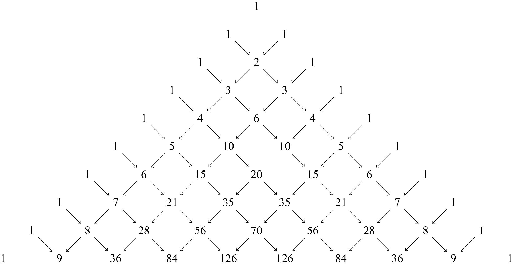
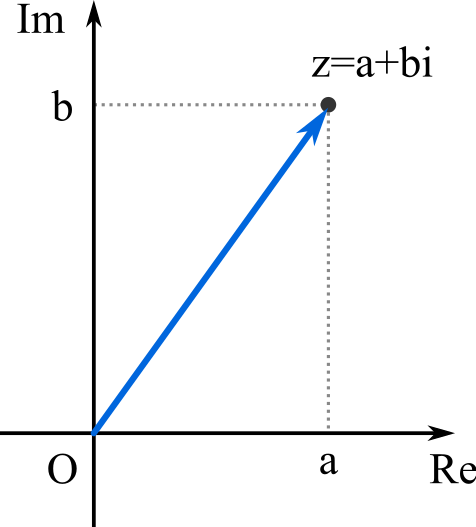
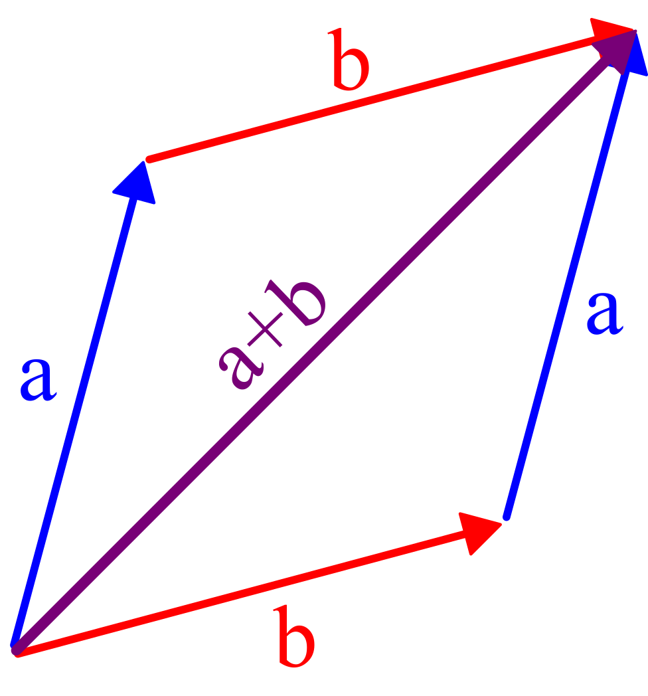
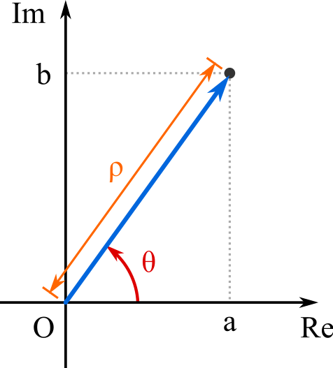
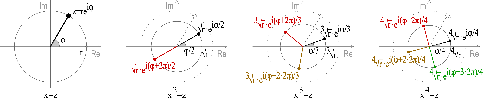

# Insiemi numerici

## Richiami d'insiemistica

Gli insiemi rappresentano una "nozione primitiva": essi sono una "collezione" / "classe" / "famiglia" di "elementi" ("oggetti") tali che, assunto $A=\{a,b,c,d\}$, allora $a\in A$ ($a$ appartiene ad $A$) oppure $e\notin A$ ($e$ non appartiene ad $A$).

Il numero di oggetti di $A$ si dice "cardinalità": $|A|=\#A$.

Dati due insiemi, $A$ e $B$, $A=B$ se e solo se $A$ e $B$ hanno gli stessi elementi: $(\forall a\in A\; a\in B) \wedge (\forall b\in B\; b\in A)$.

Insiemi speciali:

- L'insieme vuoto: $\emptyset$ ($\emptyset\subseteq A$ per ogni insieme $A$).
- L'insieme universo $U$.

### Relazioni d'inclusione

Dati due insiemi, $A$ e $B$, $A$ è contenuto in $B$ $(A\subseteq B)$ se $\forall a\in A \implies a\in B$.

La relazione d'inclusione $\subseteq$ è una "relazione d'ordine"; valgono quindi le seguenti proprietà:

- Riflessiva: $A\subseteq A$.
- Transitiva: se $A\subseteq B \wedge B\subseteq C \implies A\subseteq C$.
- Antisimmetrica: se $A\subseteq B \wedge B\subseteq A \implies A=B$.

Inclusione stretta, $A\subset B$, equivale a dire che: $(\forall a\in A\implies a\in B)\wedge (\exists b\in B: b\notin A)$.

### Operazioni con gli insiemi

Dati $A$, $B$ insiemi, sono definite le seguenti operazioni:

- Unione: $A\cup B=\{x\in U\,|\,x\in A\,\vee x\in B\}$.
- Intersezione: $A\cap B=\{x\in U\,|\,x\in A\,\wedge x\in B\}$.
- Complementare: $\overline{A}=A^{C}=\{x\in U\,|\,x\notin A\}$.
- Differenza: $A\backslash B=\{x\in U\,|\,x\in A\,\wedge x\notin B\}$.
- Prodotto cartesiano: $A\times B=\{(x,y)\,|\,x\in A\,\wedge \,y\in B\}$.

## Sommatoria

$$\sum_{i\in I}^{n} a_{i}$$

- $I$: insieme finito di "indici"; $i\in I$: "indice".
- $a_{i}$: numero reale che cambia al variare dell'indice.
- $n$: cardinalità di $I$.

Esempio:
$$\sum_{i=1}^{n}2^{i}=2^{1}+2^{2}+2^{3}=14$$

### Proprietà delle sommatorie

- Traslazione e riflessione dell'indice:
  $$\sum_{i=1}^{n}a_{i}=\sum_{i=1}^{n}a_{n-i+1}=\sum_{i=1}^{n-1}a_{n-i}$$
- Prodotto di una sommatoria per una costante:
  $$c\cdot\left(\sum_{i\in I}^{n}a_{i}\right)=\sum_{i\in I}^{n}\left(c\cdot a_{i}\right)$$
- Somma di sommatorie con stessi indici:
  $$\sum_{i\in I}^{n}a_{i}+\sum_{i\in I}^{n}b_{i}=\sum_{i\in I}^{n}(a_{i}+b_{i})$$
- Sommatoria con termini costanti:
  $$\sum_{i=1}^{n}c=c\cdot n$$
- Sommatorie "annidate":
  $$\sum_{i,j=0}^{n}a_{i,j}=\sum_{j=0}^{n}\left(\sum_{i=0}^{n}a_{i,j}\right)=a_{0,0}+a_{0,1}+...+a_{0,n}+a_{1,0}+a_{2,0}+...+a_{1,n}+...+a_{n,n}$$
- Scomposizione di sommatoria:
  $$\sum_{i=1}^{n+m}a_{i}=\sum_{i=1}^{n}a_{i}+\sum_{i=n+1}^{n+m}a_{i}$$

### Progressioni geometriche

Una progressione geometrica è una successione numerica (vedi definizione formale in seguito) in cui il rapporto fra ogni termine, a meno del primo, e il suo precedente è costante:
$$\frac{a_{n+1}}{a_{n}}=q\rightarrow a_{n}=a_{1}\cdot q^{n-1}$$
$q$ si dice "ragione della progressione".

#### Somma degli n termini di una progressione geometrica

$$\sum_{k=0}^{n}q^{k}=\frac{1-q^{n+1}}{1-q}$$
con $q\not ={1}$

### Binomio di Newton

Il binomio di Newton consente di calcolare qualunque potenza intera (positiva) di un binomio. Esso è definito come:

$$(a+b)^n=\sum_{k=0}^{n}\binom{n}{k}a^{n-k}b^{k}$$

Dove il coefficiente binomiale è equivalente alla forma:

$$\binom{n}{k}=\frac{n!}{k!(n-k)!}$$

I coefficienti binomiali si possono ricavare anche mediante il triangolo di Tartaglia:

{height=200}

## Produttoria

$$\prod_{i\in I}^{n}a_{i}$$

La "Produttoria", è il corrispettivo della sommatoria per la moltiplicazione. $I$ rappresenta la famiglia, finita, di indici tale che $i\in I$.

La produttoria non è un operatore lineare, infatti:

- $\prod_{i\in I}^{n}(a_{i}+b_{i})\not= \prod_{i\in I}^{n}a_{i}+\prod_{i\in I}^{n}b_{i}$.
- $\prod_{i\in I}^{n}ka_{i}\not= k\prod_{i\in I}^{n}a_{i}$.

Tuttavia:

- $\prod_{i\in I}^{n}ka_{i}=k^{n}\prod_{i\in I}^{n}a_{i}$.

## Numeri naturali

$$\mathbb{N}=\{0,1,2,3,4,5,...\}$$

I numeri naturali sono un concetto primitivo e sono interpretabili come una progressione geometrica di ragione 1.

L'elemento "1" è detto "elemento fondante": grazie a tale numero e all'operatore somma si possono ottenere tutti gli altri numeri.

Le operazioni interne ai numeri naturali sono la somma $+$ ed il prodotto $\cdot$ per le quali valgono le seguenti proprietà:

- Proprietà commutativa: $\forall n_{1},n_{2}\in \mathbb{N}$ $n_{1}+\cdot\;n_{2}=n_{2}+\cdot\;n_{1}$.
- Proprietà associativa: $\forall n_{1},n_{2},n_{3}\in \mathbb{N}$ $(n_{1}+\cdot\;n_{2})+\cdot\;n_{3}=n_{1}+\cdot\;(n_{2}+\cdot\;n_{3})$.
- Proprietà distributiva: $\forall n_{1},n_{2},n_{3}\in \mathbb{N}$ $n_{1}\cdot(n_{2}+n_{3})=n_{1}n_{2}+n_{1}n_{3}$.

Osservazione: ogni numero naturale $n\in\mathbb{N}$ ha in $\mathbb{N}$ il suo successore (il primo numero maggiore di $n$).

### Principio di induzione

Sia $S$ sottoinsieme dei numeri naturali tale che:

- $0\in S$.
- $\forall n\in S\rightarrow n+1\in S$.

Allora $S$ non è un sottoinsieme ma coincide con $\mathbb{N}$.

Assunto tale postulato è possibile definire il "principio di induzione": una modalità dimostrativa per predicati che coinvolgono i numeri naturali.

Sia $P(n)$ un predicato dipendente da $n\in\mathbb{N}$ dotato delle seguenti caratteristiche:

- $P(0)\;vero$;
- $P(n)\;vero$ ("Ipotesi induttiva");
- Allora anche $P(n+1)\;vero$.

Se $P(n)$ è valida in tutto $\mathbb{N}$ si parla di "induzione forte" altrimenti, se è valido solamente in un sottoinsieme ristretto dei numeri naturali, si parla di "induzione debole".

### Principio del minimo intero

Il principio del minimo intero, anche detto "principio del buon ordinamento", afferma che: "ogni sottoinsieme non vuoto di $\mathbb{N}$ ha minimo"; con "minimo" si intende quell'elemento che è minore di tutti gli altri.

Da questo principio è possibile dedurre che $\mathbb{N}$ è un insieme "ben ordinato".

Il principio del buon ordinamento è strettamente collegato al principio d'induzione: è possibile infatti dimostrarlo se e solo se si assume il principio di induzione come valido.

## Numeri interi, relativi, razionali, e reali

## Dai numeri naturali $\mathbb{N}$ ai numeri interi relativi $\mathbb{Z}$

Nell'insieme delle coppie ordinate $\mathbb{N}\times\mathbb{N}$, composte da elementi appartenenti ad $\mathbb{N}$: $(m,n)$, definisco una relazione $\sim$ tale che: $(m,n)\sim(a,b)$ sse $m+b=n+a$.

$\sim$ è una relazione di equivalenza in quanto:

- $\sim$ è riflessiva:
  - $(m,n)\sim(m,n)\longleftrightarrow m+n=n+m$.
- $\sim$ è simmetrica:
  - $(m,n)\sim(a,b)\longleftrightarrow m+b=n+a$;
  - $(a,b)\sim(m,n)\longleftrightarrow a+n=m+b$.
- $\sim$ è transitiva:
  - $(m,n)\sim(a,b)\longleftrightarrow m+b=n+a$;
  - $(a,b)\sim(p,q)\longleftrightarrow a+q=b+p$;
  - $(m,n)\sim(p,q)\longleftrightarrow m+q=n+p$.

La coppia $(m,n)$, e tutte le relative equivalenti, definiscono il risultato della differenza $m-n$.

Definisco $\mathbb{Z}=(\mathbb{N}\times\mathbb{N})\backslash\sim$ l'insieme delle classi di equivalenza di $\sim$ con le seguenti operazioni ben definite:

- $(m,n)_{\sim}+(h,k)_{\sim}=(m+h,n+k)_{\sim}$ somma algebrica;
- $(m,n)_{\sim}\cdot(h,k)_{\sim}=(mh+nk,hn+mk)_{\sim}$ prodotto.

In $\mathbb{Z}$ la somma algebrica e il prodotto sono operazioni interne.

### Dai numeri interi relativi $\mathbb{Z}$ ai numeri razionali $\mathbb{Q}$

Nell'insieme delle coppie ordinate $\mathbb{Z}\times(\mathbb{Z}\backslash\{0\})$, composte da elementi di $\mathbb{Z}$ non nulli: $(m,n)$, definisco la relazione $\approx$ tale che: $(m,n)\approx(a,b)$ sse $mb=na$.

$\approx$ è una relazione di equivalenza. La coppia $(m,n)$, e relative equivalenti, rappresentano il risultato del quoziente $m/n$.

Definisco $\mathbb{Q}=(\mathbb{Z}\times(\mathbb{Z}\backslash\{0\}))\backslash\approx$ l'insieme delle classi di equivalenza di $\approx$ con somma e prodotto ben definite. Somma e prodotto inoltre sono operazioni interne a $\mathbb{Q}$.

In definitiva $\mathbb{Q}$ è l'estensione di $\mathbb{Z}$ ottenuta mediante l'aggiunta di tutti quei numeri $z\in\mathbb{Z}$ che sono esprimibili come rapporto tra due numeri interi $m/n$.

A ogni numero razionale $q\in\mathbb{Q}$ è associata una rappresentazione decimale che può essere limitata $0.1$ o illimitata periodica $9.9999...$

Ne risulta quindi che $\mathbb{Q}$ non è "ben ordinato" (qualsiasi sottoinsieme non vuoto di $\mathbb{Q}$ potrebbe infatti non avere minimo) ma è "totalmente ordinato": dati due numeri razionali è sempre possibile operare tra loro un confronto.

La relazione d'ordine $\leq$, gode delle seguenti proprietà:

- Riflessiva: $m\leq m$.
- Antisimmetrica: $m\leq n\wedge n\leq m\rightarrow m=n$.
- Transitiva: $a\leq b\wedge b\leq c\rightarrow a\leq c$.

$\leq$ è compatibile con le operazioni di somma e prodotto:

- $\forall a,b,c$ se $a\leq b\rightarrow a+c\leq b+c$.
- $\forall a,b,c>0$ se $a\leq b\rightarrow a\cdot c\leq b\cdot c$.

### Dai numeri razionali $\mathbb{Q}$ ai numeri reali $\mathbb{R}$

È possibile estendere $\mathbb{Q}$ definendo "numero reale" un qualunque allineamento decimale sia limitato, sia illimitato periodico ma anche illimitato non periodico ($\pi$, $e$, $\sqrt{2}$, $...$).

Su $\mathbb{R}$ sono definite due operazioni:

- Somma:
  - $\forall a,b\in\mathbb{R}\rightarrow a+b\in\mathbb{R}$.
  - Gode della proprietà: commutativa, associativa.
  - Elemento neutro: $0$.
  - Elemento inverso: $\forall a\in\mathbb{R}\;\exists -a\in\mathbb{R}\rightarrow a+(-a)=0$.
- Prodotto:
  - $\forall a,b\in\mathbb{R}\rightarrow a\cdot b\in\mathbb{R}$.
  - Gode della proprietà: commutativa, associativa.
  - Elemento neutro: $1$.
  - Elemento inverso: $\forall a\in\mathbb{R}\backslash\{0\}\;\exists\; a^{-1}\;|\;a^{-1}\cdot a=1$.
- Vale la proprietà distributiva di somma rispetto al prodotto.

Anche su $\mathbb{R}$ vale la relazione d'ordine $\leq$ dotata delle caratteristiche comparabili a $\mathbb{Q}$. $\mathbb{R}$ è un campo totalmente ordinato.

#### Dimostrazione dell'irrazionalità di $\sqrt{2}$

La dimostrazione si svolge per assurdo negando la tesi: assumo $\sqrt{2}\notin\mathbb{R}$ ma $\sqrt{2}\in\mathbb{Q}$.

Esiste allora $\exists a,b\in\mathbb{N}\;, b\not ={}0$ tale che $\sqrt{2}=\frac{a}{b}$.

Posso scegliere $a,b$ in modo tale che i due numeri non abbiano fattori comuni $(a,b)=1$.

Ne consegue che: $\sqrt{2}=\frac{a}{b}\rightarrow 2=\frac{a^{2}}{b^{2}}\rightarrow 2b^{2}=a^{2}$.

$a^{2}$ è un numero pari quindi anche $a$ è un numero pari: $\exists k\in\mathbb{N}:\;a=2k$.

$2b^{2}=a^{2}=(2k)^2=4k^{2}\rightarrow b^{2}=2k^{2}$.

Anche $b^{2}$, e quindi $b$, è un numero pari.

La situazione per cui $(a,b)=1$ ma contemporaneamente $a$ pari e $b$ pari è assurda.

### Assioma di completezza

L'elemento discriminante tra $\mathbb{R}$ e $\mathbb{Q}$ è la "completezza".

Siano $A,B\subseteq\mathbb{R}$ tali che $A,B\not ={}\emptyset$ e $A\cap B=\emptyset$ e $A\cup B=\mathbb{R}$ e tali che $a<b$ $\forall a\in A, \forall b\in B$. Allora esiste un unico $s\in\mathbb{R}$ tale che:

- $a\leq s\leq b$.
- $a\leq s<b$.
- $a<s\leq b$.

$s$ prende il nome di "elemento separatore".

Osservazione: l'assioma di completezza non vale in $\mathbb{Q}$.

Dimostrazione:

- $A=\{x\in\mathbb{Q}\;|\;x^{2}<2\}$.
- $B=\{x\in\mathbb{Q}\;|\;x^{2}\ge 2\}$.
- $A\not ={}\emptyset$, $B\not ={}\emptyset$, $A\cap B=\emptyset$, $A\cup B=\mathbb{Q}$.
- Esiste un unico valore $s$ tale che: $\forall a\in A$, $\forall b\in B$, $a<b$.
- Tale valore è $s=\sqrt{2}$ ma $s\notin\mathbb{Q}$.

$\mathbb{R}$, a differenza di $\mathbb{Q}$, è quindi un campo ordinato completo.

### Numerabilità

$\mathbb{N}\subseteq\mathbb{Z}\subseteq\mathbb{Q}\subseteq\mathbb{R}$ sono tutti insiemi infiniti; com'è possibile confrontare la loro numerosità?

Definizione: un insieme $X$ si dice infinito quando esiste un suo sottoinsieme proprio $X_{0}$ che ha la stessa cardinalità (ossia esiste una corrispondenza biunivoca tra gli elementi di $x\in X$ e $x_{0}\in X_{0}$).

Definizione: un insieme $E$ si dice numerabile se ha la stessa cardinalità di $N$; esiste quindi $f:\mathbb{N}\rightarrow E$ biunivoca.

Osservazione: $\mathbb{Z}$ è numerabile.

#### Numerabilità di $\mathbb{Q}$

Dimostro che l'insieme dei numeri razionali positivi è numerabile.

Esprimo ogni numero di $\mathbb{Q}^{+}$ mediante frazione del tipo $\frac{n}{m}$, $n,m$ numeri interi positivi. Le frazioni si possono disporre secondo una tabella triangolare infinita:

| $\frac{n}{m}$, con $n+m=...$ |               |               |               |               |
| ---------------------------- | ------------- | ------------- | ------------- | ------------- |
| $2$                          | $\frac{1}{1}$ |               |               |               |
| $3$                          | $\frac{1}{2}$ | $\frac{2}{1}$ |               |               |
| $4$                          | $\frac{1}{3}$ | $\frac{3}{1}$ | $\frac{2}{2}$ |               |
| $5$                          | $\frac{1}{4}$ | $\frac{4}{1}$ | $\frac{2}{3}$ | $\frac{3}{2}$ |
| $...$                        | $...$         |               |               |               |

Tutte le frazioni che rappresentano numeri razionali positivi compaiono in tabella almeno una volta; è quindi possibile mettere in corrispondenza biunivoca $\mathbb{N}$ con $\mathbb{Q}^{+}$ percorrendo la tabella riga dopo riga (ognuna di lunghezza infinita) saltando eventualmente un elemento quando è uguale a uno già incontrato. Esemplificando:

| $\mathbb{N}:$     | $1$           | $2$           | $3$           | $4$           | $5$           | $...$ |
| ----------------- | ------------- | ------------- | ------------- | ------------- | ------------- | ----- |
| $\mathbb{Q}^{+}:$ | $\frac{1}{1}$ | $\frac{1}{2}$ | $\frac{2}{1}$ | $\frac{1}{3}$ | $\frac{3}{1}$ | $...$ |

Questo dimostra che $\mathbb{Q}^{+}$ è numerabile. Analogamente allora anche $\mathbb{Q}$ è numerabile: associando a ogni $n\in\mathbb{N}$ un numero $q\in\mathbb{Q}$ posso stabilire, alternando tra numeri positivi e negativi, che $q=-q^{+}$ dove $q^{+}\in\mathbb{Q}^{+}$.

#### Non numerabilità di $\mathbb{R}$

Osservazione: la cardinalità di $\mathbb{R}$ è detta "potenza del continuo".

Mostro che $[0,1]\subset\mathbb{R}$ non è numerabile. Si può mostrare che ogni intervallo $I\subset\mathbb{R}$ (con $I$ non ridotto a un singolo numero) ha la stessa cardinalità di $\mathbb{R}$; conseguentemente $\mathbb{R}$ non è numerabile.

Dimostro per assurdo assumendo che $[0,1]$ si numerabile e dispongo i suoi numeri in un elenco completo $[0,1]=\{x_{n}\}_{n=0}^{\infty}$.

Ogni numero della successione $r_{1},r_{2},r_{3},...$ sarà costruito nella forma $r_{i}=0,a_{1}a_{2}a_{3}...$ dove ogni $a_{i}$ è una delle 10 cifre decimali $(0,1,2,...,9)$. Se le cifre sono tutte $0$ si avrà che $r_{i}=0$ mentre se sono tutte $9$ si avrà che $r_{i}=0,999...\approx1$.

Definisco ora il numero decimale:
$$r=0,b_{1}b_{2}b_{3}...$$
dove le cifre $b_{i}$ sono definite in funzione di $a_{i}$: se $a_{i}$ è una cifra $0,1,2,3,4$ allora $b_{i}=5$ altrimenti se è una cifra $5,6,7,8,9$ allora $b_{i}=4$.

Con questa metodologia costruttiva risulta sempre che $b_{i}\not=a_{i}$. Il numero $r$, composto solamente da cifre $4$ o $5$, è appartenente all'intervallo $[0,1]$ ma non trova corrispondenza in nessuna $x_{n}$ dell'elenco originario.

Ne consegue che $\mathbb{R}$ non è numerabile.

## Insiemi numerici limitati

Dati $a,b,c\in\mathbb{R}$ si definiscono "intervallo": $(a,b)$; $[a,b]$; $[a,b)$; $(a,b]$; $(-\infty, a)$; $(-\infty, a]$; $(a, +\infty)$; $[a, +\infty)$.

Sia $x_{0}\in\mathbb{R}$ definisco intorno di $x_{0}$ di raggio $\delta$, l'insieme dei $x\in\mathbb{R}$ che distano da $x_{0}$ per meno di $\delta$: $(x_{0}-\delta, x_{0}+\delta)$.

Tra questi, sia $E$ un insieme numerico $E\subseteq\mathbb{R}$:

- $E$ si dice limitato se esistono $m,M\in\mathbb{R}$ tali che $m\leq x\leq M\;\forall x\in E$.
- $E$ si dice superiormente limitato se esiste $M\in\mathbb{R}$ tale che $x\leq M\;\forall x\in E$.
- $E$ si dice inferiormente limitato se esiste $m\in\mathbb{R}$ tale che $x\ge m\;\forall x\in E$.

### Massimo, minimo, maggiorante, minorante

Sia $E$ un insieme numerico $E\subseteq\mathbb{R}$.

- $M\in\mathbb{R}$ si dice massimo per $E$ se $M\in E$ e $M\ge x\;\forall x\in E$.
- $m\in\mathbb{R}$ si dice minimo per $E$ se $m\in E$ e $M\leq x\;\forall x\in E$.

Osservazione: anche se $E$ è limitato non è detto che abbia minimo o massimo.

- $a\in\mathbb{R}$ è maggiorante per $E$ se $\forall x\in E\; x\leq a$.
- $b\in\mathbb{R}$ è minorante per $E$ se $\forall x\in E\; x\ge b$.

Non è comunque necessario che $a,b$ debbano appartenere ad $E$.

### Estremo superiore e inferiore

Sia $E$ un insieme numerico $E\subseteq\mathbb{R}$.

- Si dice "estremo superiore" di $E$ ($sup(E)$) il minimo dell'insieme dei maggioranti di $E$.
- Si dice "estremo inferiore" di $E$ ($inf(E)$) il massimo dell'insieme dei minoranti di $E$.

#### ! Teorema di esistenza degli estremi superiori e/o inferiori

Ogni sottoinsieme $E$ di $\mathbb{R}$, non vuoto, è limitato superiormente (o inferiormente) e ammette estremo superiore (o inferiore).

Sia $E\subseteq R$, $E\not={}\emptyset$, un insieme limitato superiormente. Definisco $M\not={}\emptyset$ l'insieme dei maggioranti.

Pongo $N=\mathbb{R}\backslash M$ e osservo che:

- $N\not={}\emptyset$.
- $N\cup M=\mathbb{R}$.
- $N\cap M=\emptyset$.

Sia $y\in N$: $y$ non è un maggiorante di $E$.

- $\forall y\in N$ esiste $e\in E$ con $y<e$.
- $\forall x\in M$ $x$ è maggiorante di $E$ $x>e$.

Ne consegue che: $y<e<x$. $M$ e $N$ soddisfano le ipotesi dell'assioma di completezza: esiste quindi un solo $s\in R$ tale che: $(y<s\leq x)$ e $(y\leq s<x)$ $\forall y\in N$ $\forall x\in M$.

Noto che $s\in M$ quindi $s$ è il minimo di $M$ ovvero $sup(e)$. Infatti se $s\in N$ allora esisterebbe $d\in E$ con $d>s$ ($e$ non è un maggiorante).

Posso quindi costruire: $\frac{s+d}{2}$ tale che $s<\frac{s+d}{2}<d$. Ma $\frac{s+d}{2}$ non è un maggiorante (in quanto maggiore di $s$) contro l'unicità dell'elemento separatore: $s\notin N$.

## Numeri complessi

In $\mathbb{R}$ esistono delle equazioni polinomiali che non hanno soluzione (ex. $x^{2}+1=0$).

È quindi necessario estendere l'insieme dei numeri reali in modo che un'equazione polinomiale di grado $n$ abbia esattamente $n$ soluzioni (contate le molteplicità).

Sia $\mathbb{R}\times\mathbb{R}$ l'insieme delle coppie ordinate di numeri reali $(a,b)\in\mathbb{R}\times\mathbb{R}$.

Definisco le seguenti operazioni $\forall(a,b),(c,d)\in\mathbb{R}$:

- Somma: $(a,b)+(c,d)=(a+c,b+d)$.
- Prodotto: $(a,b)\cdot(c,d)=(ac-bd, ad+bc)$.

Osservazioni:

- $\forall(a,b)\in\mathbb{R}\times\mathbb{R}$
  - $(a,b)+(0,0)=(a+0,b+0)=(a,b)$, $(0,0)$ è l'elemento neutro per la somma.
- $\forall(a,b)\in\mathbb{R}\times\mathbb{R}$
  - $(a,b)\cdot(1,0)=(a\cdot 1-b\cdot 0, a\cdot 0 + b\cdot 1)=(a,b)$, $(1,0)$ è l'elemento neutro per il prodotto.
- La somma e il prodotto sono commutativi e associativi.

- $\forall(a,b)\in\mathbb{R}\times\mathbb{R}$ esiste $(-a,-b)$, elemento inverso per la somma, tale che: $(a,b)+(-a,-b)=(0,0)$.
- $\forall(a,b)\in\mathbb{R}\times\mathbb{R}$ esiste $(\frac{a}{a^2+b^2}, -\frac{b}{a^2+b^2})$, elemento inverso per il prodotto, tale che $(a,b)\cdot (\frac{a}{a^2+b^2}, -\frac{b}{a^2+b^2})=(1,0)$.

$\mathbb{R}\times\mathbb{R}=\mathbb{R}^2$, unitamente alle operazioni sopra descritte, forma il campo dei numeri complessi $\mathbb{C}$.

### L'unità immaginaria

$\mathbb{C}$ estende $\mathbb{R}$ ne consegue che tutti i numeri nella forma $(a,0)$ sono appartenenti ai numeri reali.

- $(a,0)+(b,0)=(a+b,0)$.
- $(a,0)\cdot(b,0)=(ab,0)$.

Il numero nella forma $(0,1)$ è invece un numero tale che:

- $(0,1)+(0,1)=(0,2)$.
- $(0,1)\cdot(0,1)=(-1,0)=-1$.

Il numero $(0,1)$, comunemente detto anche "unità immaginaria" e indicato con $i$, è quindi tale che $i^{2}=-1$.

Ogni numero complesso si può quindi scrivere come:
$$z=(a,b)=(a,0)+(0,1)(b,0)=a+bi$$
Questa forma è detta "forma algebrica" ed è costituita da:

- $a=Re(z)$, parte reale.
- $b=Im(z)$, parte immaginaria.
- $i$, unità immaginaria.

Anche le operazioni possono essere riscritte come:

- Somma: $(a+c)+i(b+d)$.
- Prodotto: $(ac-db)+i(ad+cb)$.

Nota: $\mathbb{C}$ non è un campo ordinato dunque non è possibile stabilire relazioni d'ordine $\leq$.

### Il piano complesso

Dato un numero complesso $z$ è possibile rappresentarlo nel piano complesso di Gauss.

{height=150}

Nel piano di gauss è possibile interpretare la somma tra due numeri complessi come la somma tra due vettori.

{height=150}

Considerando l'angolo $\theta$ compreso tra il l'asse dei numeri reali e il "vettore" $z$, di modulo $\rho$, è possibile scrivere $z$ in forma trigonometrica.

{height=150}

Osservazione: l'angolo $\theta$ non è univocamente definito, è necessario infatti considerare gli angoli associati.

Esiste una relazione tra la forma algebrica e quella trigonometrica, in particolare:
$$\begin{cases}
    a &= \rho\cos\theta \\
    b &= \rho\sin\theta
\end{cases}$$
Dove, per teorema di Pitagora:
$$|z|=\rho=\sqrt{a^{2}+b^{2}}\geq 0$$
Osservazione:
$$\frac{b}{a}=\tan\theta$$
Definizione: Dato il numero complesso $z=a+bi\in\mathbb{C}$ definisco il coniugato il numero $\overline{z}=a-bi$.

Nel piano di Gauss il numero coniugato $\overline{z}$ è una riflessione di $z$ rispetto all'asse reale; $Arg(\overline{z})=2\pi-Arg(z)$.

Proprietà:

- $|z|=|\overline{z}|$
- $z+\overline{z}=a+bi+a-bi=2a$
- $z-\overline{z}=a+bi-a+bi=2bi$
- $z\cdot\overline{z}=(a+bi)(a-bi)=a^2-b^{2}i^{2}=a^{2}+b^{2}$
- $\frac{z}{\overline{z}}=\frac{a+bi}{a-bi}\cdot\frac{a+bi}{a+bi}=\frac{a^{2}-b^{2}}{a^{2}+b^{2}}+i\frac{2ab}{a^{2}+b^{2}}$

### ! Diseguaglianza triangolare

$$|z+w|\leq|z|+|w|\;\forall z,w\in\mathbb{C}$$
Dimostrazione:

- Assumo $z=a+bi$ e $w=c+di$
- Per definizione: $|z+w|\ge0$ e $|z|+|w|\ge0$
- Provo che: $(|z+w|)^{2}\leq(|z|+|w|)^{2}$
  - Sviluppo il primo termine:
  - $|z+w|^{2}=(a+c)^{2}+(b+d)^2=$
  - $=a^{2}+c^{2}+2ac+b^{2}+d^{2}+2bd=$
  - $=(a^2+b^2)+(c^2+d^2)+2(ac+bd)=$
  - $=|z|^{2}+|w|^{2}+2(ac+bd)$
  - Sviluppo il secondo termine:
  - $(|z|+|w|)^{2}=|z|^{2}+|w|^{2}+2|z||w|$
  - Confronto i due termini:
  - $|z|^{2}+|w|^{2}+2(ac+bd)\leq|z|^{2}+|w|^{2}+2|z||w|$
  - $ac+bd\leq|z||w|$
  - Se $ac+bd\ge0$ posso procedere all'elevamento a potenza
  - $(ac+bd)^2\leq|z|^{2}|w|^{2}$
  - $(ac+bd)^2\leq(a^{2}+b^{2})(c^{2}+d^{2})$
  - $a^{2}d^{2}+b^{2}c^{2}-2abcd\ge0$
  - $(ad-bc)^{2}\ge0\;\forall a,b,c,d\in\mathbb{R}$.

### Forma esponenziale

$$z=a+ib=\rho(\cos\theta+i\sin\theta)=\rho e^{i\theta}$$

### ! Formula di De Moivre

$$z^{n}=\rho^{n}(\cos{n\theta}+i\sin{n\theta})$$

In termini geometrici il vettore $z$ nel piano di Gauss subisce una contrazione/dilatazione del modulo e una rotazione di un angolo $\theta$ per $n$ volte.

La dimostrazione si ricava, considerando un generico numero complesso $z$ scritto in forma esponenziale, mediante applicazione delle proprietà delle potenze.

### Radici n-esime complesse

Dato un numero complesso $w$, di definisce radice n-esima complessa di $w$ un numero $z\in\mathbb{C}$ tale che $z^{n}=w$.

Teorema: sia $w\in\mathbb{C}\; w\not={0}\; w=r(\cos{\phi}+i\sin{\phi})$ e $n$ numero intero $n\ge1$, esistono esattamente $n$ radici n-esime di $w$ ($z_{0},...,z_{n-1}$) determinate nella forma:
$$z_{k}=\sqrt[n]{\rho}\left(\cos{\left(\frac{\theta+2\pi k}{n}\right)}+i\sin{\left(\frac{\theta+2\pi k}{n}\right)}\right)$$
dove: $k\in\mathbb{N}, 0\leq k\leq n-1$.

Per accertarsi della bontà del teorema è sufficiente applicarla a una generica radice n-esima ottenuta mediante la formula di De Moivre.

Osservazione: le radici n-esime si dispongono, nel piano di Gauss, in modo regolare su una circonferenza di centro $O(0,0)$ e raggio $\sqrt[n]{n}$.

{height=150}

### Teorema fondamentale dell'algebra

Un'equazione polinomiale di grado $n$ ($n\ge1$) a coefficienti complessi:
$$a_{n}z^{n}+a_{n-1}z^{n-1}+...+a_{1}z^{1}+a_{0}z^{0}=0$$
Ha esattamente $n$ radici complesse contate con le loro molteplicità.
