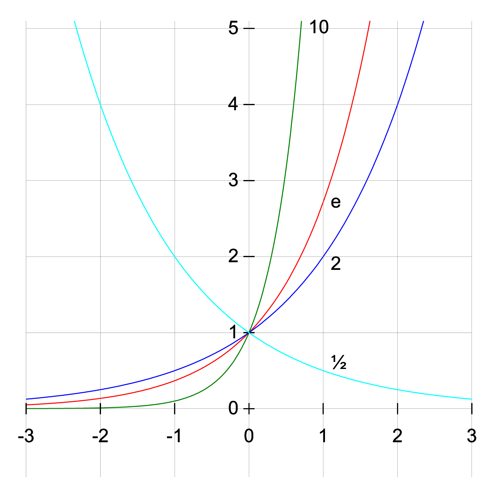

# Funzioni

## Caratteristiche generali

Una funzione è formalmente definita come una terna di elementi $(A,B,f)$ tale che:

- $A, B$: insiemi generici.
- $f$: legge che associa a ogni elemento $a\in A$ uno e un solo elemento $b\in B$.

{height=150}

Data quindi la funzione $f:A\rightarrow B$, $A$ prende il nome di "dominio" di $f$ mentre $B$ è detto "codominio". $b\in B$ è si dice "immagine" di $a\in A$ (che, a sua volta, è "controimmagine" di $b\in B$) attraverso la funzione $f$.

L'insieme delle immagini di $f$: $Im(f)=\{y\in B\;|\;\exists x\in A:f(x)=y\}$ è sempre un sottoinsieme del dominio $Im(f)\subseteq B$.

L'insieme delle coppie ordinate $(x,y)$, derivanti dal prodotto cartesiano $A\times B$, è definito "grafico" di $f$; formalmente: $\Gamma (f)=\{(x,y)\in A\times B\;|\; x\in A \wedge y=f(x)\}$.

### Funzioni reali di variabili reali

Principale soggetto dello studio dell'analisi funzionale sono le funzioni reali di variali reali $f:A\in\mathbb{R}\rightarrow\mathbb{R}$.

Il "dominio naturale" ($\mathbb{D}_{f}$) di una funzione è l'insieme dei valori reali tali che la funzione $f$ abbia significato.

Data una funzione $f:A\rightarrow B$, se $f$ è funzione reale di variabile reale $\mathbb{R}^{\mathbb{R}}$, allora $Im(f)\subseteq B$ è anche sottoinsieme di $\mathbb{R}$: $Im(f)\subseteq B\subseteq R$.

### Funzioni limitate

Una funzione $f:A\rightarrow B$ si dice "limitata" se è limitato l'insieme $Im(f)$ ovvero se $\exists M\in\mathbb{R}$ e $\exists m\in\mathbb{R}$ tali che: $\forall x\in A: m\leq f(x)\leq M$.

Una funzione $f:A\rightarrow B$ si dice "superiormente limitata" se è superiormente limitato l'insieme $Im(f)$ ovvero se $\exists M\in\mathbb{R}$ tale che: $f(x)\leq M\;\forall x\in A$.

Una funzione $f:A\rightarrow B$ si dice "inferiormente limitata" se è inferiormente limitato l'insieme $Im(f)$ ovvero se $\exists m\in\mathbb{R}$ tale che: $m\leq f(x)\;\forall x\in A$.

### Funzioni monotone

Sia la funzione $f:A\subseteq\mathbb{R}\rightarrow\mathbb{R}$ allora:

- $f$ si dice "crescente" in $I\subseteq A$ se: $\forall x_{1},x_{2}\in\mathbb{R}$ con $x_{2}\ge x_{1}$ allora $f(x_{2})\ge f(x_{1})$.
- $f$ si dice "strettamente crescente" in $I\subseteq A$ se: $\forall x_{1},x_{2}\in\mathbb{R}$ con $x_{2}>x_{1}$ allora $f(x_{2})>f(x_{1})$.
- $f$ si dice "decrescente" in $I\subseteq A$ se: $\forall x_{1},x_{2}\in\mathbb{R}$ con $x_{2}\leq x_{1}$ allora $f(x_{2})\leq f(x_{1})$.
- $f$ si dice "strettamente decrescente" in $I\subseteq A$ se: $\forall x_{1},x_{2}\in\mathbb{R}$ con $x_{2}<x_{1}$ allora $f(x_{2})<f(x_{1})$.

Tutte queste funzioni sono "monotone" in $I$.

### Funzioni suriettive e iniettive

Sia $f:A\rightarrow B$:

- $f$ è "suriettiva" se $Im(f)=B$ oppure, in maniera analoga, se: $\forall b\in\mathbb{R}\;\exists x\in A\;|\; f(x)=b$.
  - La suriettività non è una caratteristica particolarmente stringente in quanto è possibile restringere il codominio di $f$ in modo che coincida con la sua immagine creando quindi una nuova funzione $\overline{f}$.
- $f$ è iniettiva se $\forall x_{1},x_{2}\in\mathbb{R}$ $f(x_{1})=f(x_{2})$ se e solo se $x_{1}=x_{2}$.
  - Per ogni elemento del codominio esiste ed è unico un elemento del dominio. $\forall y\in Im(f)\;\exists !x\in A:f(x)=y$.

Se una funzione è sia suriettiva che iniettiva allora è "biunivoca".

{height=150}

### Funzioni inverse

Sia $f: A\subseteq\mathbb{R}\rightarrow\mathbb{R}$ una funzione iniettiva definisco $f^{-1}:Im(f)\rightarrow A=\mathbb{D}_{f}$ la sua funzione inversa che associa a ogni elemento del codominio di $f$ la relativa controimmagine nel dominio: $f^{-1}(y)=x\Longleftrightarrow f(x)=y$.

Osservazione: definendo la funzione come $f^{-1}:Im(f)\rightarrow A=\mathbb{D}_{f}$ ho forzato la suriettività della funzione.

{height=150}

#### Proprietà delle funzioni inverse

- $\mathbb{D}_{f^{-1}}=Im(f)$.
- $\mathbb{D}_{f}=Im(f^{-1})$.
- $f^{-1}:Im(f)\rightarrow\mathbb{D}_{f}$ è biunivoca.
- Il grafico di $f^{-1}$ si ottiene mediante simmetria di $f$ rispetto alla bisettrice del primo e terzo quadrante.

Osservazione: se una funzione è monotona allora è iniettiva (e quindi è possibile costruirne l'inversa).

### Funzioni pari e dispari

Sia $f:A\subseteq\mathbb{R}\rightarrow\mathbb{R}$ è "funzione pari" se e solo se:

- $A$ è dominio simmetrico rispetto all'origine;
- $\forall x\in A\; f(-x)=f(x)$.

Sia $f:A\subseteq\mathbb{R}\rightarrow\mathbb{R}$ è "funzione dispari" se e solo se:

- $A$ è dominio simmetrico rispetto all'origine;
- $\forall x\in A\; f(-x)=-f(x)$.

Osservazione:

- Se $f$ è pari allora $\Gamma(f)$ è simmetrico rispetto all'asse $y$.
- Se $f$ è dispari allora $\Gamma(f)$ è simmetrico rispetto all'origine.

{height=200}

### Funzioni periodiche

Si dice che $f$ è periodica di periodo $T$ se: $\forall x\in\mathbb{D}_{f}$ esiste $x+T\in\mathbb{D}_{f}$ allora $f(x)=f(x+T)$.

{height=100}

### Funzioni elementari

- Funzioni potenza a esponente naturale, intero, razionale o reale.
  - $f(x)=x^{a}$

{height=300}

- Funzioni esponenziali e logaritmiche.
  - $f(x)=a^{x}$
  - $f(x)=\log_{a}(x)$

{height=300}

- Funzioni trigonometriche.
  - $f(x)=\sin{(x)}$
  - $f(x)=\cos{(x)}$
  - $f(x)=\tan{(x)}$

{height=300}

- Funzioni trigonometriche inverse.
  - $f(x)=\arcsin{(x)}$
  - $f(x)=\arccos{(x)}$
  - $f(x)=\arctan{(x)}$

{height=300}

Osservazione: Le funzioni inverse $\arcsin{(x)}$, $\arccos{(x)}$ e $\arctan{(x)}$ sono quindi costruite su una restrizione del dominio di $\sin{(x)}$, $\cos{(x)}$ e $\tan{(x)}$.

## Limiti di funzioni

Sia $f:A\subseteq\mathbb{R}\to\mathbb{R}$ una funzione. Un "punto di accumulazione", $x_{0}$, riferito al dominio $A$, è così definito se ogni intorno di $x_{0}$ contiene punti di $A$ distinti, escluso lo stesso $x_{0}$; ovvero se $\forall r>0\; ((x_{0}-r;x_{0}+r)\backslash\{x_{0}\})\cap A\not ={\emptyset}$.

Sia $f:A\subseteq\mathbb{R}\to\mathbb{R}$ funzione e sia $x_{0}$ punto di accumulazione per il dominio. Si dice che $f$ ha limite $l\in\mathbb{R}$ per $x$ che tende a $x_{0}$: $\lim_{x\to x_{0}}f=l$ se $\forall\epsilon >0\;\exists\delta=\delta (\epsilon)>0:\forall x\in ((x_{0}-\epsilon;x_{0}+\epsilon)\backslash\{x_{0}\})\cap A\; |f(x)-l|<\epsilon$.

### ! Teorema ponte fra funzioni e successioni

Sia $f:A\subseteq\mathbb{R}\to\mathbb{R}$ funzione e sia $x_{0}$ punto di accumulazione per il dominio; allora $\lim_{x\to x_{0}}f=l$ se e solo se per ogni successione $\{x_{n}\}$ di numeri reali, con $x_{n}\not ={x_{0}}$, convergente a $x_{0}$, si ha che $\lim_{n\to +\infty}f(x_{n})=l$.

Dimostrazione:

- Se $\lim_{x\to x_{0}}f(x)=l\implies\lim_{n\to +\infty}f(x_{n})=l\; \forall x_{n}\to x_{0}$.

Considero una successione $x_{n}$, non costante, convergente a $x_{0}$ tale quindi che $\lim_{n\to +\infty}x_{n}=x_{0}$.

Scelgo $\delta=\overline{\epsilon}:\forall n\ge n_{0} |x_{n}-x_{0}|<\overline{\epsilon}=\delta$; si ottiene quindi che: $-\delta<x_{n}-x_{0}<\delta$ quindi $x_{0}-\delta<x_{n}<x_{0}+\delta$ ne consegue che $x_{n}\in(x_{0}-\delta;x_{0}+\delta)$ ossia $|f(x_{n})-l|<\epsilon$.

Per definizione di limite: $\lim_{n\to +\infty}f(x_{n})=l$.

- Se $\lim_{n\to +\infty}f(x_{n})=l$ $\forall x_{n}\to x_{0}$ allora $\lim_{x\to x_{0}}f(x)=l$.

Per assurdo suppongo non valga $\lim_{x\to x_{0}}f(x)=l$ allora $\exists\epsilon_{0}>0:\forall\delta>0$ esiste un punto $x(\delta)$ tale che $|x(\delta)-x_{0}|<\delta$ ma allo stesso tempo $|f(x(\delta))-l|>\epsilon_{0}$.

Costruisco una successione che tende a $x_{0}$ ma per cui $f(x_{n})$ non converge a $l$.

Pongo $x_{n}=x(\delta)$ con $\delta=\frac{1}{n}\;\forall\delta>1$; poiché $|x(\delta)-x_{0}|<\delta$ questo implica che $|x_{n}-x_{0}|<\frac{1}{n}=\delta$ ma ciò è equivalente a dire che la successione $x_{n}=x(\delta)$ converge a $x_{0}$.

Ne consegue che $|f(\delta(\epsilon))-l|>\epsilon_{0}$ quindi $\exists\epsilon_{0}\ge 0:\forall n\ge 1\; |f(x_{n})-l|\ge\epsilon_{0}$ ma ciò è equivalente a dire che $\lim_{n\to +\infty}f(x_{n})\not ={l}$ che è assurdo.

### ! Teorema di unicità del limite

Sia $f:A\subseteq\mathbb{R}\to\mathbb{R}$ funzione e sia $x_{0}$ punto di accumulazione per il dominio. Se $\lim_{x\to x_{0}}f(x)=l_{1}$ e $\lim_{x\to x_{0}}f(x)=l_{2}$ allora $l_{1}=l_{2}$.

Dimostrazione: Per assurdo assumo che $l_{1}\not ={l_{2}}$ ma che $l_{1}>l_{2}$. Scelgo $\epsilon=\frac{l_{1}-l_{2}}{2}>0$.

Considero $(l_{1}-\epsilon;l_{1}+\epsilon)$ e $(l_{2}-\epsilon;l_{2}+\epsilon)$; noto che $(l_{1}-\epsilon;l_{1}+\epsilon)\cap(l_{2}-\epsilon;l_{2}+\epsilon)=\emptyset$.

Considero i limiti:

- $\lim_{x\to x_{0}}f(x)=l_{1}$: $\forall\epsilon>0\;\exists\delta_{1}:\forall x\in ((x_{0}-\delta_{1};x_{0}+\delta_{1})\backslash\{x_{0}\})$ ne consegue che $f(x)\in (l_{1}-\epsilon;l_{1}+\epsilon)$;
- $\lim_{x\to x_{0}}f(x)=l_{2}$: $\forall\epsilon>0\;\exists\delta_{2}:\forall x\in ((x_{0}-\delta_{2};x_{0}+\delta_{2})\backslash\{x_{0}\})$ ne consegue che $f(x)\in (l_{2}-\epsilon;l_{2}+\epsilon)$.

Sia ora $\delta=\min(\delta_{1}, \delta_{2})$ tale che $\forall x\in((x_{0}-\delta;x_{0}+\delta)\backslash\{x_{0}\})$; $f(x)\in(l_{1}-\epsilon;l_{1}+\epsilon)\cap(l_{2}-\epsilon;l_{2}+\epsilon)$; siccome la relazione deve valere $\forall\epsilon>0$ deve valere anche per $\epsilon=\frac{l_{1}-l_{2}}{2}$ ma per tale valore $(l_{1}-\epsilon;l_{1}+\epsilon)\cap(l_{2}-\epsilon;l_{2}+\epsilon)=\emptyset$; assurdo.

$l_{1}=l_{2}$ necessariamente.

### Teorema del confronto

Siano $f,g,h:A\subseteq\mathbb{R}\to\mathbb{R}$ funzioni e sia $x_{0}$ punto di accumulazione per $A$. Se esiste $\delta>0$ tale che $\forall x\in((x_{0}-\delta;x_{0}+\delta)\backslash\{x_{0}\})\cap A$ si ha che $f(x)\leq g(x)\leq h(x)$ ed esistono e sono finiti $\lim_{x\to x_{0}}f(x)=\lim_{x\to x_{0}}h(x)=l$ allora anche $\lim_{x\to x_{0}}g(x)=l$.

### Teorema del cambiamento di variabili

Siano $f:A\subseteq\mathbb{R}\to\mathbb{R}$ e $g:B\subseteq\mathbb{R}\to\mathbb{R}$ funzioni tali che $f(A)\subseteq f(B)$ e sia $x_{0}$ punto di accumulazione per $A$; se $\lim_{x\to x_{0}}f(x)=l$ (con $f(x)\not ={l}$ se $x\not ={x_{0}}$) e $\lim_{\gamma\to l}g(\gamma)=L$ allora $\lim_{x\to x_{0}}g(f(x))=\lim_{\gamma\to l}g(\gamma)=L$.

### Limiti destro e sinistro

Sia $f:A\subseteq\mathbb{R}\to\mathbb{R}$ funzione e sia $x_{0}$ punto di accumulazione per il dominio.

- $f$ ha "limite sinistro", per $x\to x_{0}$, $\lim_{x\to x_{0}^{-}}f(x)=l$ se $\forall\epsilon>0\exists\delta=\delta(\epsilon)>0:\forall x\in (x_{0}-\delta;x_{0})\cap A$ si ha che $|f(x)-l|<\epsilon$.
- $f$ ha "limite destro", per $x\to x_{0}$, $\lim_{x\to x_{0}^{+}}f(x)=l$ se $\forall\epsilon>0\exists\delta=\delta(\epsilon)>0:\forall x\in (x_{0};x_{0}+\delta)\cap A$ si ha che $|f(x)-l|<\epsilon$.

Teorema: Il limite $\lim_{x\to x_{x}}f(x)=l$ esiste se e solo se sono coincidenti i limiti destro e sinistro di $f(x)$ per $x\to x_{0}$.

### Formalizzazione dei limiti

- Sia $f:A\subseteq\mathbb{R}\to\mathbb{R}$ funzione e sia $x_{0}$ punto di accumulazione per il dominio. Si dice che, per $x\to x_{0}$:
  - $f$ diverge a $+\infty$ se: $\lim_{x\to x_{0}}f(x)=+\infty$ ossia $\forall M>0\;\exists\delta=\delta(M)>0$ tale che $\forall x\in ((x_{0}-\delta;x_{0}+\delta)\backslash\{x_{0}\})\cap A$ si ha che $f(x)>M$.
  - $f$ diverge a $-\infty$ se: $\lim_{x\to x_{0}}f(x)=-\infty$ ossia $\forall m>0\;\exists\delta=\delta(m)>0$ tale che $\forall x\in ((x_{0}-\delta;x_{0}+\delta)\backslash\{x_{0}\})\cap A$ si ha che $f(x)<-m$.
- Sia $f:A\subseteq\mathbb{R}\to\mathbb{R}$ funzione con $A\subseteq(a;+\infty)\backslash A\subseteq(-\infty;b)$. Si dice che:
  - Per $x\to +\infty$, $f(x)$ converge a $l$ se: $\lim_{x\to +\infty}f(x)=l$ ossia $\forall\epsilon>0\;\exists k=k(\epsilon)>0$ tale che $\forall x>k$ si ha che $|f(x)-l|<\epsilon$.
  - Per $x\to -\infty$, $f(x)$ converge a $l$ se: $\lim_{x\to -\infty}f(x)=l$ ossia $\forall\epsilon>0\;\exists k=k(\epsilon)>0$ tale che $\forall x<-k$ si ha che $|f(x)-l|<\epsilon$.
  - Per $x\to +\infty$, $f(x)$ diverge a $+\infty$ se: $\lim_{x\to +\infty}f(x)=+\infty$ ossia $\forall M>0\;\exists k=k(M)>0$ tale che $\forall x>k$ si ha che $f(x)>M$.
  - Per $x\to +\infty$, $f(x)$ diverge a $-\infty$ se: $\lim_{x\to +\infty}f(x)=-\infty$ ossia $\forall m>0\;\exists k=k(m)>0$ tale che $\forall x>k$ si ha che $f(x)<-m$.

## Infiniti e infinitesimi

Sia $f:A\subseteq\mathbb{R}\to\mathbb{R}$ funzione e sia $x_{0}$ punto di accumulazione per il dominio. Allora:

- $f$ è infinitesima, per $x\to x_{0}$, se $\lim_{x\to x_{0}}f(x)=0$.
- $f$ è infinita, per $x\to x_{0}$, se $\lim_{x\to x_{0}}f(x)=\pm\infty$.

### Gerarchia degli infinitesimi

Siano $f$ e $g$ funzioni infinitesime per $x\to x_{0}$ e $g(x)\not ={0}$, sempre in un intorno di $x_{0}$; allora:

- Se $\lim_{x\to x_{0}}\frac{f(x)}{g(x)}=0$, f è un infinitesimo di ordine superiore rispetto a $g$.
- Se $\lim_{x\to x_{0}}\frac{f(x)}{g(x)}=\pm\infty$, f è un infinitesimo di ordine inferiore rispetto a $g$.

### O-piccoli

Date $f$, $g$ infinitesime per $x\to x_{0}$ se $f$ è un infinitesimo di ordine superiore rispetto a $g$ diciamo che $f$ è o-piccolo di $g$:

$$f(x)=o(g(x))$$

Proprietà degli o-piccoli:

- $c\cdot o(x^{\alpha})=o(c\cdot x^{\alpha})=o(x^{\alpha})$ con $c\not ={0}$.
- $o(x^{\alpha})\pm o(x^{\beta})=o(x^{\omega})$ con $\omega =\min{(\alpha, \beta)}$ se $x\to 0$.
- $o(x^{\alpha})\pm o(x^{\beta})=o(x^{\omega})$ con $\omega =\max{(\alpha, \beta)}$ se $x\to +\infty$.
- $o(x^{\alpha})\cdot o(x^{\beta})=o(x^{\alpha + \beta})$.
- $x^{\beta}\cdot o(x^{\alpha})=o(x^{\alpha + \beta})$.
- Se $g(x)=o(x^{\alpha})$ e $f(x)=o(g(x))$ allora $f(x)=o(x^{\alpha})$.

### Confronto tra successioni infinite o infinitesime

Date $f$, $g$ infinitesime (o infinite) per $x\to x_{0}$ con $g(x)\not ={0}$ in un intorno di $x_{0}$; se esistono $\alpha >0$ e $l\in\mathbb{R}$ tali che:

$$\lim_{x\to x_{0}}\frac{f(x)}{g(x)^{\alpha}}=l$$

Allora si dice che $f$ è di ordine $\alpha$ rispetto a $g$ infinitesimo (o infinito) campione.

Non è sempre possibile determinare l'ordine rispetto alle funzioni campione.

## Funzioni asintotiche

Date $f$ e $g$ funzioni, $f$ e $g$ sono asintotiche, per $x\to x_{0}$, se $\lim_{x\to x_{0}}\frac{f(x)}{g(x)}=1$. $f(x)\sim_{x\to x_{0}}g(x)$.

### Asintoti

Date $f$ e $g$ funzioni asintotiche per $x\to \pm\infty$: $f(x)\sim_{x\to \pm\infty}g(x)$.

Se considero $g(x)=x$ e $\lim_{x\to +\infty}f(x)=+\infty$ posso stimare:

$$\lim_{x\to +\infty}\frac{f(x)}{x}=\begin{cases}\infty\;&sopralineare\\0\;&sottolineare\\m\not={0}\;&lineare\end{cases}$$

#### Asintoto obliquo

Sia $f(x)\sim_{x\to +\infty}mx$ lineare a $+\infty$; se esiste finito $q=\lim_{n\to +\infty}(f(x)-mx)$ allora diciamo che la retta $y=mx+q$ è l'asintoto obliquo.

#### Asintoto verticale

Se $f(x)$ è una funzione tale che $\lim_{x\to x_{0}}f(x)=\pm\infty$ allora la retta $x=x_{0}$ è asintoto verticale.

#### Asintoto orizzontale

Se $f(x)$ è una funzione tale che $\lim_{x\to \pm\infty}f(x)=l$ allora la retta $y=l$ è asintoto orizzontale.

## Continuità

Sia $f:A\subseteq\mathbb{R}\to\mathbb{R}$ funzione. Dato $x_{0}\in A$ allora $f$ è continua in $x_{0}$ se esiste ed è finito il limite $\lim_{x\to x_{0}}f(x)=f(x_{0})$.

Tutte le funzioni elementari sono continue nel loro dominio.

### Discontinuità

#### Discontinuità eliminabile

$\lim_{x\to x_{0}}f(x)=l$ esiste finito; tuttavia, $f(x_{0})\not ={l}$.

{height=150}

La discontinuità può essere eliminata alterando $f(x)$ e riscrivendola come funzione a tratti.

#### Discontinuità di salto

$\lim_{x\to x_{0}^{+}}f(x)\not={}\lim_{x\to x_{0}^{-}}f(x)$.

{height=150}

#### Discontinuità di III specie

Il limite $\lim_{x\to x_{0}}f(x)$ non esiste oppure non è finito.

{height=150}

### Teoremi sulla continuità

#### Teorema di continuità di somma, prodotto, quoziente di funzioni continue

Siano $f,g:A\subseteq\mathbb{R}\to\mathbb{R}$ funzioni continue in $x_{0}\in A$; allora:

- $f\pm g$, $f\cdot g$, $kf$ (con $k\in\mathbb{R}$) sono funzioni continue in $x_{0}\in A$.
- $\frac{f}{g}$ è anch'essa continua in $x_{0}\in A$ se $g(x_{0})\not ={0}$.

#### ! Teorema di continuità di funzioni composte e inverse

Siano $f:A\subseteq\mathbb{R}\to\mathbb{R}$ e $g:B\subseteq\mathbb{R}\to\mathbb{R}$ con $f(A)\subseteq B$ funzioni. Se $f$ è continua in $x_{0}\in A$ e $g$ continua in $f(x_{0})\in B$, allora anche $h(x)=f\circ g$ è continua in $x_{0}\in A$.

Dimostrazione: Sia $a_{n}$ una successione convergente a $x_{0}$ ($\lim_{n\to +\infty}a_{n}=x_{0}$). Allora $f(a_{n})=b_{n}$ converge a $f(x_{0})$ perché $f$ è continua; ma questa considerazione è estendibile a $g$: $g(b_{n})=g(f(a_{n}))=c_{n}$ successione che converge a $g(f(x_{0}))$ in quanto $g$ continua.

Quindi $\forall a_{n}$ successioni che tendono a $x_{0}$: $\lim_{n\to +\infty}h(a_{n})=h(x_{0})\Longleftrightarrow\lim_{x\to x_{0}}h(x)=h(x_{0})$ cioè $h$ è continua in $x_{0}$.

Corollario: Sia $f:A\subseteq\mathbb{R}\to\mathbb{R}$ funzione invertibile e continua su $A$; allora $f^{-1}:f(A)\to A$ funzione inversa è anch'essa continua su $A$.

## Teoremi sulle funzioni continue

### Teorema di permanenza del segno

Sia $f:A\subseteq\mathbb{R}\to\mathbb{R}$ funzione continua in $x_{0}\in A$. Allora:

- Se $f(x_{0})>0$ allora $\exists\delta>0$ tale che $\forall x\in (x_{0}-\delta;x_{0}+\delta)\cap A$ si ha che $f(x)>0$.
- Se $f(x_{0})<0$ allora $\exists\delta>0$ tale che $\forall x\in (x_{0}-\delta;x_{0}+\delta)\cap A$ si ha che $f(x)<0$.

La dimostrazione deriva dal teorema di permanenza del segno per i limiti.

### ! Teorema degli zeri

Sia $f:A\subseteq\mathbb{R}\to\mathbb{R}$ funzione continua su $[a,b]\subseteq A$ allora se $f(a)\cdot f(b)<0$ allora $f$ ammette almeno uno zero in $[a,b]$ ovvero esiste $c\in [a,b]:f(c)=0$.

{height=150}

Dimostrazione: La dimostrazione si svolge per assurdo:

Poniamo $f(a)<0<f(b)$. Si suppone quindi che $f(x)$ sia diverso da zero per ogni $x$ nell'intervallo. Si definisce quindi l'insieme $E$: $E=\{x\in[a,b]:f(x)<0\}$

L'insieme $E$ non è vuoto, perché contiene $a$, inoltre $E$ è superiormente limitato da $b$ poiché $E\subset[a,b],$ dunque per l'assioma di completezza esiste $x_{0}=\sup(E)\leq b$.

L'estremo superiore è caratterizzato da queste due proprietà:

- $x_{0}$ è un maggiorante di $E$;
- Se $y_{0}<x_{0}$ allora $y_{0}$ non è un maggiorante di $E$.

Il valore $f(x_{0})$ è diverso da zero, ed è quindi positivo o negativo. In entrambi i casi si giunge a un assurdo.

- Se $f(x_{0})<{0}$, allora per le ipotesi $x_{0}<b$ e per la permanenza del segno esiste un $\delta>0$ tale che per ogni $x$ appartenente all'intorno $(x_{0},x_{0}+\delta)\;\subseteq[a,b]$ vale $f(x)<0$, ma ciò è assurdo perché in contrasto con la prima proprietà dell'estremo superiore.
- Se $f(x_{0})>{0}$, allora per le ipotesi $x_{0}>a$ e sempre per la permanenza del segno, esiste $\delta>0$ tale che per ogni $x$ appartenente all'intorno $(x_{0}-\delta,x_{0})\;\subseteq[a,b]$ vale $f(x)>0$: ciò è in contrasto con la seconda proprietà dell'estremo superiore.

### ! Teorema dei valori intermedi

Sia $f:A\subseteq\mathbb{R}\to\mathbb{R}$ funzione continua in $[a,b]\subseteq A$; $f$ assume tutti i valori compresi fra $f(a)$ e $f(b)$ ovvero $\forall\gamma\in [f(a),f(b)]$ esiste $c\in [a,b]$ tale che $f(c)=\gamma$.

{height=150}

Dimostrazione:

- Se $f(a)=f(b)$ non c'è nulla da dimostrare: $c=a=b$.

- Se $f(a)<f(b)$ considero la funzione $g:[a,b]\to\mathbb{R}$ definita come $g(x)=f(x)-\gamma$ con $\gamma\in(f(a),f(b))$. $g$ è continua in $[a,b]$; trovo $\gamma$ tale che $g(a)=(f(a)-\gamma)<0$ e $g(b)=(f(b)-\gamma)>0$. Siccome $g(a)\cdot g(b)<0$ per il teorema degli zeri esiste $c\in(a,b)$ tale che $g(c)=0$ ossia $f(c)-\gamma=0\implies f(c)=\gamma$ $\forall\gamma\in(f(a),f(b))$.

#### Corollari e osservazioni

- Sia $I\subseteq\mathbb{R}$ un intervallo e sia $f:I\to\mathbb{R}$ continua allora $f(I)$ è un intervallo dove $f$ assume tutti i valori compresi tra $Inf(I)$ e $Sup(I)$.
- Sia $I\subseteq\mathbb{R}$ un intervallo e sia $f:I\to\mathbb{R}$ continua allora se $f$ è iniettiva su $I$ allora $f$ è strettamente monotona su $I$.
  - Dimostrazione: Assumo, per assurdo, che $f$ non sia monotona; esistono quindi $a,b,c\in I:a<b<c$ e $f(b)>f(a)>f(c)$. Restringo $f$ all'intervallo $[b,c]$; $f$ assume tutti i valori compresi fra $f(c)$ e $f(a)$: esiste $x_{0}\in(b,c):f(x_{0})=f(a)$. Ne consegue che $f$ non è iniettiva perché $a\not ={x_{0}}$ ma $f(a)=f(x_{0})$.
- Sia $I\subseteq\mathbb{R}$ un intervallo e sia $f:I\subseteq\mathbb{R}\to\mathbb{R}$ continua e iniettiva in $I$. Detta $f^{-1}:f(I)\to\mathbb{R}$ la funzione inversa di $f$, allora $f^{-1}$ è continua in $f(I)$.
  - Dimostrazione: Sia $f$ continua e iniettiva su $I$ allora $f$ è strettamente monotona su $I$. Essendo $f(I)$ un intervallo anche $f^{-1}$ è strettamente monotona su $f(I)$. Se, per assurdo, $f^{-1}$ non fosse continua, la discontinuità potrebbe essere di salto o eliminabile ma allora l'immagine di $I$ mediante $f$ non sarebbe più un intervallo mentre $f^{-1}(f(I))=I$.

### Teorema di Weirstrass

Sia $f:[a,b]\subseteq\mathbb{R}\to\mathbb{R}$ una funzione continua in un intervallo chiuso e limitato $[a,b]$. Allora $f$ ammette massimo e minimo assoluti in $[a,b]$ ovvero esistono $x_{1},x_{2}\in[a,b]$ tali che $\forall x\in [a,b]$ si ha che:

- $f(x)\ge f(x_{1})$ $x_{1}$ minimo assoluto.
- $f(x)\leq f(x_{2})$ $x_{2}$ massimo assoluto.

{height=150}
