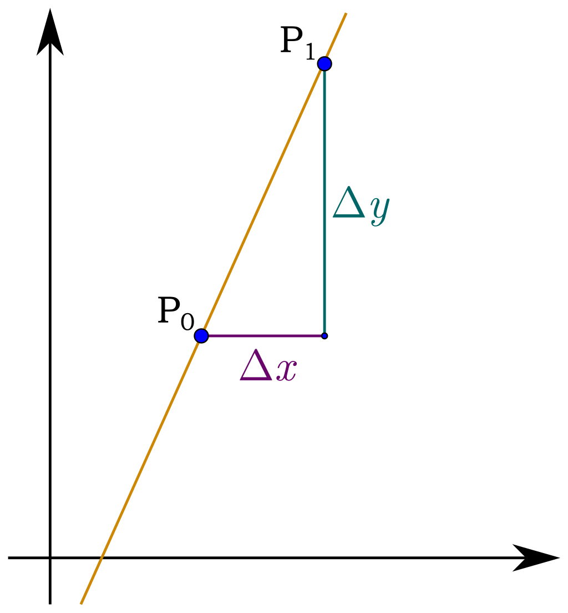
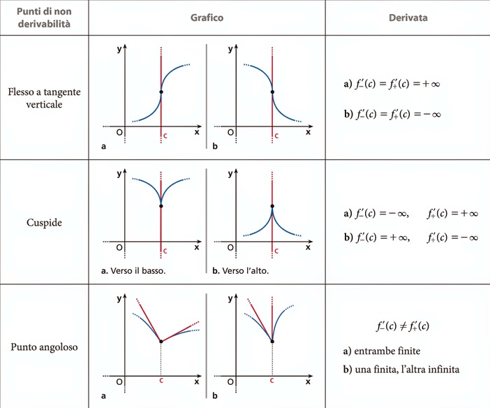
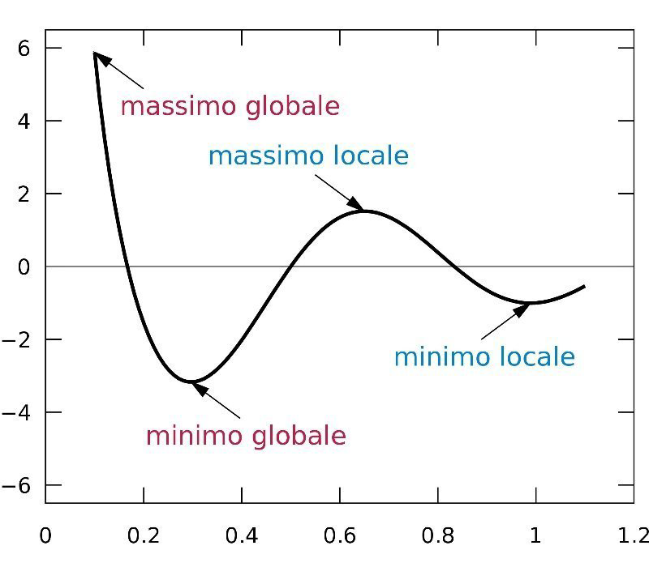
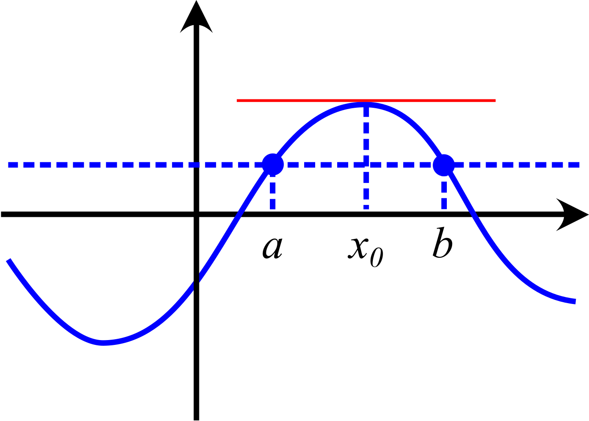
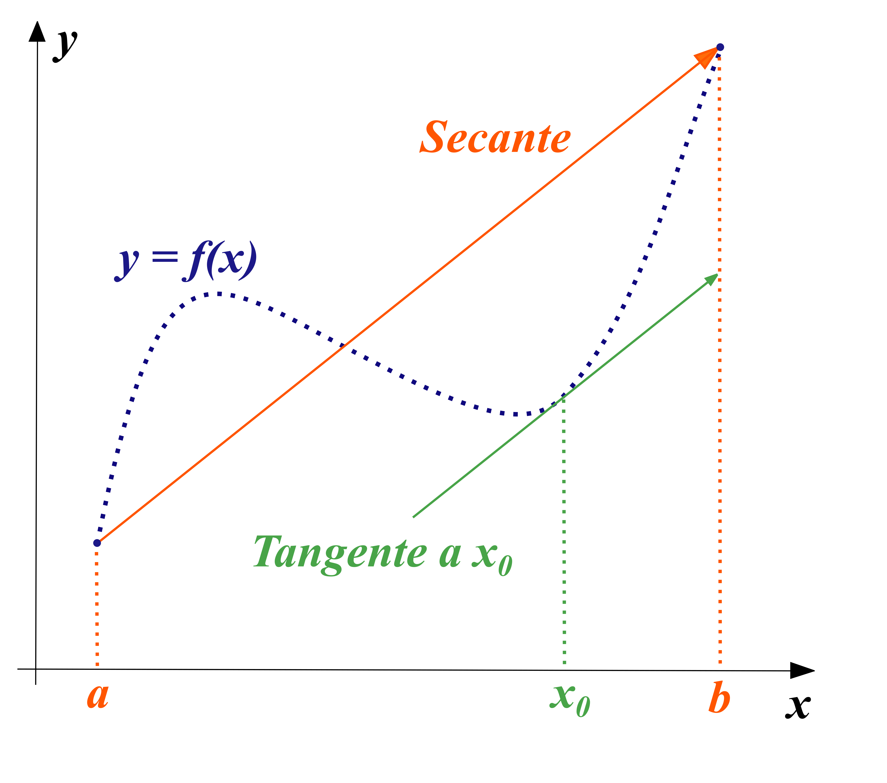
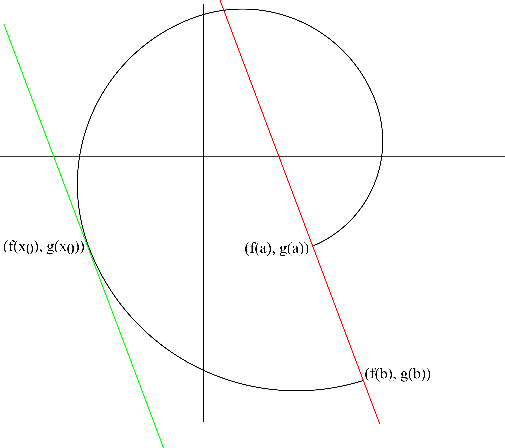
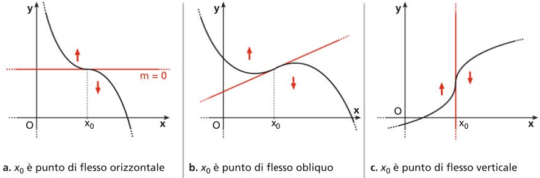

# Calcolo differenziale

## Differenziabilità

### Il problema della retta tangente

Sia $f:A\subseteq\mathbb{R}\to\mathbb{R}$ una funzione. Scelgo $x_{0}\in A$ tale che $y_{0}=f(x_{0})$; considero il punto $P_{0}(x_{0},y_{0})$. Scelgo poi $x_{1}\in A: x_{1}\not ={x_{0}}$ tale che $y_{1}=f(x_{1})$; considero il punto $P_{1}(x_{1},y_{1})$.

Costruisco la retta passante per $P_{1}$ e $P_{0}$ la cui equazione è:

$$y=f(x_{0})+\frac{f(x_{1})-f(x_{0})}{x_{1}-x_{0}}(x-x_{0})$$

{height=150}

Se $x_{1}$ si avvicina a $x_{0}$, fissato, si modifica il coefficiente angolare della retta fino a che quest'ultima, che in origine era secante, diviene tangente al grafico di $f(x)$ in $x_{0}$.

Generalizzando, posso interpretare le coordinate di $P_{1}$ in funzione della loro "distanza" rispetto al riferimento $x_{0}$: $x_{1}=x_{0}+h$, $y_{1}=f(x_{0}+h)$.

#### Definizione: derivabilità

Sia $f:A\subseteq\mathbb{R}\to\mathbb{R}$ una funzione; essa si dice "derivabile" in $x_{0}$ se esiste, ed è finito, il limite del rapporto incrementale:

$$\lim_{h\to 0}\frac{f(x_{0}+h)-f(x_{0})}{h}=f^{'}(x_{0})$$

#### Definizione: differenziabilità

Sia $f:A\subseteq\mathbb{R}\to\mathbb{R}$ funzione e sia $x_{0}\in A$, la funzione si dice "differenziabile" se esiste la retta tangente al grafico di $f(x)$ in $x_{0}$ ed è una buona approssimazione di $f(x_{0})$.

$$\lim_{x\to x_{0}}\frac{f(x)-[f(x_{0})+m(x-x_{0})]}{x-x_{0}}=0$$

### Continuità di funzioni derivabili

#### ! Teorema: $f(x)$ è derivabile in $x_{0}$ se e solo se $f(x)$ è differenziabile in $x_{0}$

Dimostrazione:

- Se $f(x)$ è derivabile in $x_{0}$ allora è differenziabile (in $x_{0}$); per ipotesi esiste quindi finito il limite $\lim_{x\to x_{0}}\frac{f(x)-f(x_{0})}{x-x_{0}}=f^{'}(x_{0})$.

Costruisco la retta tangente al grafico di $f(x)$: $y=f(x_{0})+f^{'}(x_{0})(x-x_{0})$; tale funzione è una buona approssimazione di $f(x_{0})$?

$$\lim_{x\to x_{0}}\frac{f(x)-[f(x_{0})+f^{'}(x_{0})(x-x_{0})]}{x-x_{0}}=0$$

$$\lim_{x\to x_{0}}\frac{f(x)-f(x_{0})}{x-x_{0}}-\frac{f^{'}(x_{0})(x-x_{0})}{x-x_{0}}=0$$

$$\lim_{x\to x_{0}}f^{'}(x_{0})-f^{'}(x_{0})=0$$

La retta tangente al grafico di $f(x)$ in $x_{0}$ è una buona approssimazione di $f(x_{0})$. $f(x)$ è quindi differenziabile in $x_{0}$.

- Se $f(x)$ è differenziabile in $x_{0}$ allora è derivabile (sempre in $x_{0}$). Considero la retta tangente a $f(x)$ di equazione: $y=f(x_{0})+m(x-x_{0})$, vale il seguente limite:

$$\lim_{x\to x_{0}}\frac{f(x)-[f(x_{0})+m(x-x_{0})]}{x-x_{0}}=0$$

$$\lim_{x\to x_{0}}\frac{f(x)-f(x_{0})}{x-x_{0}}-\frac{m(x-x_{0})}{x-x_{0}}$$

Ne consegue che posso fissare $m$:

$$m=\lim_{x\to x_{0}}\frac{f(x)-f(x_{0})}{x-x_{0}}$$

$$m=f^{'}(x_{0})$$

$f(x)$ è quindi derivabile in $x_{0}$.

#### ! Teorema: Se $f(x)$ è differenziabile in $x_{0}$ allora la funzione è continua in tal punto

Se $f(x)$ è differenziabile in $x_{0}$ allora esiste finito il limite:

$$\lim_{x\to x_{0}}\frac{f(x)-f(x_{0})}{x-x_{0}}=f^{'}(x_{0})$$

Voglio dimostrare che $f(x)$ è continua in $x_{0}$:

$$\lim_{x\to x_{0}}f(x)=f(x_{0})\Longleftrightarrow\lim_{x\to x_{0}}f(x)-f(x_{0})=0$$

$$\lim_{x\to x_{0}}f(x)-f(x_{0})\frac{x-x_{0}}{x-x_{0}}=\lim_{x\to x_{0}}f^{'}(x_{0})(x-x_{0})=0$$

Attenzione: il teorema non è invertibile!

### Teoremi di derivazione (somma, prodotto e rapporto)

Siano $f,g:A\subseteq\mathbb{R}\to\mathbb{R}$ funzioni, sia $x_{0}\in A$ con $f$ e $g$ derivabili in $x_{0}$; allora:

- $(f+g)(x)$ è derivabile in $x_{0}$: $(f+g)^{'}(x)=f^{'}(x)+g^{'}(x)$;
- $k\cdot f(x)$ è derivabile in $x_{0}$: $k\cdot f^{'}(x)=k\cdot f^{'}(x)$.

- $f(x)\cdot g(x)$ è derivabile in $x_{0}$: $(f\cdot g)^{'}(x)=f^{'}(x)\cdot g(x)+f(x)\cdot g^{'}(x)$.
- $\frac{f(x)}{g(x)}$ è derivabile in $x_{0}$: $(\frac{f}{g})^{'}(x)=\frac{f^{'}(x)g(x)-f(x)g^{'}(x)}{g(x)^{2}}$.

### Derivata di funzioni composte

Siano $f:A\subseteq\mathbb{R}\to\mathbb{R}$ e $g:B\subseteq\mathbb{R}\to\mathbb{R}$ funzioni con $f(A)\subseteq B$. Sia $x_{0}\in A$ tale che $f(x)$ è derivabile in $x_{0}$ e sia $y_{0}\in B: y_{0}=f(x_{0})$ tale che $g(x)$ è derivabile in $x_{0}$. Ne risulta che $g\circ f$ è derivabile in $x_{0}$ e vale:

$$(g\circ f)^{'}(x)=g^{'}(x)\cdot f^{'}(x)$$

### Derivata delle funzioni inverse

Sia $f:A\subseteq\mathbb{R}\to\mathbb{R}$ una funzione continua e invertibile; se $f(x)$ è derivabile in $x_{0}\in A$ e $f^{-1}(x_{0})\not ={0}$ allora $f^{-1}(x)$ è derivabile in $f(x_{0})$ e vale la seguente relazione:

$$(f^{-1})^{'}(f(x_{0}))=\frac{1}{f^{'}(x_{0})}$$

### Derivate destre e sinistre

Sia $f:A\subseteq\mathbb{R}\to\mathbb{R}$ una funzione, scelgo $x_{0}\in A$ allora:

- $f(x)$ è derivabile a destra in $x_{0}$ se esiste finito il limite $\lim_{h\to 0^{+}}\frac{f(x_{0}+h)-f(x_{0})}{h}=f^{'}_{+}(x_{0})$.
- $f(x)$ è derivabile a sinistra in $x_{0}$ se esiste finito il limite $\lim_{h\to 0^{-}}\frac{f(x_{0}+h)-f(x_{0})}{h}=f^{'}_{-}(x_{0})$.

Osservazione: $f(x)$ è derivabile in $x_{0}$ se e solo se $f^{'}_{-}(x_{0})=f^{'}_{+}(x_{0})$.

### Calcolo delle derivate delle funzioni elementari

|   |   |
|---|---|
|$f(x)=x^{\alpha}\rightarrow f^{'}(x)=\alpha x^{\alpha-1}$||
|$f(x)=e^{x}\rightarrow f^{'}(x)=e^{x}$|$f(x)=a^{x}\rightarrow f^{'}(x)=a^{x}\ln{a}$|
|$f(x)=\ln{x}\rightarrow f^{'}(x)=\frac{1}{x}$|$f(x)=\log_{a}{x}\rightarrow f^{'}(x)=\frac{1}{x\ln{a}}$|
|$f(x)=\sin{x}\rightarrow f^{'}(x)=\cos{x}$|$f(x)=\arcsin{x}\rightarrow f^{'}(x)=\frac{1}{\sqrt{1-x^{2}}}$|
|$f(x)=\cos{x}\rightarrow f^{'}(x)=-\sin{x}$|$f(x)=\arccos{x}\rightarrow f^{'}(x)=-\frac{1}{\sqrt{1-x^{2}}}$|
|$f(x)=\tan{x}\rightarrow f^{'}(x)=\frac{1}{\cos{x}^2}$|$f(x)=\arctan{x}\rightarrow f^{'}(x)=\frac{1}{1+x^{2}}$|

### Punti di non derivabilità

{height=450}

Osservazione: Per studiare la derivabilità in un punto si calcola il limite del rapporto incrementale. (Non calcolare il limite della derivata!)

## Teoremi sulle funzioni derivabili

### ! Teorema di Fermat

Data $f:[a,b]\to\mathbb{R}$ una funzione derivabile in $x_{0}\in(a,b)$. Se $x_{0}$ è punto di massimo o minimo relativo per $f$ allora: $f^{'}(x_{0})=0$.

{height=150}

Dimostrazione: Sia $x_{0}\in(a,b)$ minimo relativo per $f$ allora esiste $\delta>0:\forall x\in(x_{0}-\delta;x_{0}+\delta)\cap[a,b]\; f(x)\ge f(x_{0})$.

Allora il rapporto:
$$\frac{f(x)-f(x_{0})}{x-x_{0}}$$
può essere:

- $>0$ se $x>x_{0}$;
- $<0$ se $x<x_{0}$.

Per ipotesi $f$ è derivabile in $x_{0}$ quindi esiste finito:
$$\lim_{x\to x_{0}}\frac{f(x)-f(x_{0})}{x-x_{0}}=f^{'}(x_{0})$$

Considero quindi le derivate destre e sinistre ma, per il teorema di permanenza del segno:

$$\begin{cases}f^{'}_{+}(x_{0})\ge 0&\\ f^{'}_{-}(x_{0})\leq 0&\end{cases}\implies f^{'}(x_{0})=0$$

Osservazione: Avere $f^{'}(x_{0})=0$ non è condizione necessaria affinché $x_{0}$ sia estremante ma allo stesso tempo non è una condizione nemmeno sufficiente. (Possono esistere punti di massimo/minimo relativi anche dove la derivata prima non esiste).

### ! Teorema di Rolle

Data $f:[a,b]\to\mathbb{R}$ una funzione derivabile in $(a,b)$ e continua in $[a,b]$ e tale che $f(a)=f(b)$; allora esiste $x_{0}\in(a,b)$ tale che $f^{'}(x_{0})=0$.

{height=150}

Dimostrazione: Se $f$ è continua in $[a,b]$ allora vale il teorema di Weirstrass quindi $f$ ammette massimi e minimi assoluti in $[a,b]$.

Siano $f(x_{1})=M$ punto di massimo assoluto e $f(x_{2})=m$ punto di minimo assoluto.

Se $x_{1}\in(a,b)$, $x_{1}$ è un massimo per $f$ e $f$ è derivabile in $x_{1}$, allora per il teorema di Fermat, $f^{'}(x_{1})=0$.

Se $x_{2}\in(a,b)$, $x_{2}$ è un minimo per $f$ e $f$ è derivabile in $x_{2}$, allora per il teorema di Fermat, $f^{'}(x_{2})=0$.

Se il massimo e il minimo sono raggiunti entrambi negli estremi si ha che $f(x_{1})=f(x_{2})\implies m=M$; la funzione è quindi costante e la sua derivata è nulla in tutti i punti compresi tra $(a,b)$.

Osservazione: Non è possibile indebolire le ipotesi del teorema di Rolle.

### ! Teorema di Lagrange

Data $f:[a,b]\to\mathbb{R}$ una funzione derivabile in $(a,b)$ e continua in $[a,b]$ allora esiste $x_{0}\in(a,b)$ tale che

$$f^{'}(x_{0})=\frac{f(b)-f(a)}{b-a}$$

{height=150}

Dimostrazione: Costruisco la retta passante per $(a,f(a))$ e $(b,f(b))$ di equazione:

$$y=f(a)+\frac{f(b)-f(a)}{b-a}(x-a)$$

Definisco la funzione:

$$g(x)=f(x)-\left[f(a)+\frac{f(b)-f(a)}{b-a}(x-a)\right]$$

Caratteristiche:

- $g$ è continua in $[a,b]$ e derivabile in $(a,b)$;
- $g(a)=g(b)=0$.

Posso utilizzare le considerazioni del teorema di Rolle sulla funzione $g$ ossia esiste $x_{0}\in (a,b): g^{'}(x_{0})=0$.

$$g^{'}(x_{0})=f^{'}(x_{0})-\frac{f(b)-f(a)}{b-a}=0$$

$$f^{'}(x_{0})=\frac{f(b)-f(a)}{b-a}$$

### ! Test di monotonia

Sia $f:(a,b)\subseteq\mathbb{R}\to\mathbb{R}$ una funzione derivabile in $(a,b)$ allora:

- Se $f$ è crescente in $(a,b)$ $\longleftrightarrow$ $f^{'}(x)\ge 0$ $\forall x\in(a,b)$;
- Se $f$ è decrescente in $(a,b)$ $\longleftrightarrow$ $f^{'}(x)\leq 0$ $\forall x\in(a,b)$.

Dimostrazione: Considero i seguenti casi:

- Se $f$ è crescente in $(a,b)$ $\implies$ $f^{'}(x)\ge 0$ $\forall x\in(a,b)$.

Considero il rapporto incrementale di $f$:

$$\lim_{h\to 0}\frac{f(x_{0}+h)-f(x_{0})}{h}\ge 0$$

in quanto $f(x_{0}+h)\ge f(x_{0})$ con $h>0$ e $f$ crescente.

Per il teorema di permanenza del segno:

$$\lim_{h\to 0}\frac{f(x_{0}+h)-f(x_{0})}{h}=f^{'}(x_{0})\ge 0$$

- Se $f^{'}(x)\ge 0$ $\forall x\in(a,b)$ $\implies$ $f$ è crescente in $(a,b)$.

Siano $x_{1},x_{2}\in(a,b)$ con $x_{2}> x_{1}$ devo mostrare che $f(x_{2})\ge f(x_{1})$.

Considero l'intervallo $[x_{1},x_{2}]$; la funzione $f:[x_{1},x_{2}]\to\mathbb{R}$ è continua in $[x_{1},x_{2}]$ e derivabile in $(x_{1},x_{2})$.

Per il teorema di Lagrange: esiste $x_{0}\in (x_{1},x_{2})$ tale che:

$$f^{'}(x_{0})=\frac{f(x_{2})-f(x_{1})}{x_{2}-x_{1}}$$

Per ipotesi $f^{'}(x)\ge 0$ siccome $x_{0}\in(a,b)$

$$f^{'}(x_{0})=\frac{f(x_{2})-f(x_{1})}{x_{2}-x_{1}}\ge 0$$

Siccome $x_{2}> x_{1}\; x_{2}-x_{1}>0\implies f(x_{2})-f(x_{1})\ge 0$ ossia $f(x_{2})\ge f(x_{1})$.

Analoga dimostrazione è possibile per le funzioni decrescenti.

Corollario: Sia $f:(a,b)\subseteq\mathbb{R}\to\mathbb{R}$ funzione derivabile in $(a,b)$. Allora $f^{'}(x)=0$ $\longleftrightarrow$ $f$ è costante in $(a,b)$.

### ! Teorema di Cauchy

Siano $f,g:[a,b]\to\mathbb{R}$ continue su $[a,b]$ e derivabili su $(a,b)$ tali che $g^{'}(x)\not ={0}$ $\forall x\in (a,b)$. Allora esiste $x_{0}\in (a,b)$ tale che:

$$\frac{f^{'}(x_{0})}{g^{'}(x_{0})}=\frac{f(b)-f(a)}{g(b)-g(a)}$$

Osservazione: $g(b)\not ={g(a)}$, se fosse $g(b)=g(a)$, per il teorema di Rolle applicato a $g$ dovrebbe esistere $x_{0}\in (a,b):g^{'}(x_{0})=0$ ma ciò è un assurdo.

{height=150}

Dimostrazione: Costruisco la funzione:

$$h(x)=[g(b)-g(a)]f(x)-[f(b)-f(a)]g(x)$$

$h$ è continua in $[a,b]$ e differenziabile in $(a,b)$.

$$h(a)=g(b)f(a)-f(b)g(a)$$

$$h(b)=-g(a)f(b)+f(a)g(b)$$

Ma ciò implica che $h(a)=h(b)$.

Vale il teorema di Rolle per la funzione $h$ su $[a,b]$ e quindi esiste $x_{0}\in (a,b)$ tale che $h^{'}(x_{0})=0$.

$$h^{'}(x_{0})=[g(b)-g(a)]f^{'}(x_{0})-[f(b)-f(a)]g^{'}(x_{0})=0$$

Ne consegue che:

$$\frac{f^{'}(x_{0})}{g^{'}(x_{0})}=\frac{f(b)-f(a)}{b-a}$$

### ! Teorema di De L'Hospital

Date $f,g:[a,b]\subseteq\mathbb{R}\to\mathbb{R}$ funzioni derivabili in $(a,b)$ (escluso al più $x_{0}\in(a,b)$) è noto che:

- $g(x)\not ={0}\wedge g^{'}(x)\not ={0}$ $\forall x\in(a,b)\backslash\{x_{0}\}$;
- $\lim_{x\to x_{0}}f(x)=\lim_{x\to x_{0}}g(x)=0$ (oppure $\pm\infty$);
- $\lim_{x\to x_{0}}\frac{f^{'}(x)}{g^{'}(x)}=l$ esiste ($l$ può essere anche $\pm\infty$).

Allora: $\lim_{x\to x_{0}}\frac{f(x)}{g(x)}=l$.

(Il teorema vale anche se $x\to\pm\infty$ se $(a,b)=(a,+\infty)$ oppure se $(a,b)=(-\infty,b)$).

Dimostrazione: $f$ e $g$ possono essere prolungate per continuità in $x_{0}$ ponendo $f(x_{0})=g(x_{0})=0$ sia $\lim_{x\to x_{0}}\frac{f^{'}(x)}{g^{'}(x)}=l$ finito. Allora per definizione di limite:

$$\forall\epsilon>0\exists\delta>0:\forall x\in(x_{0}-\delta;x_{0}+\delta)\backslash\{x_{0}\}$$

$$\left|\frac{f^{'}(x)}{g^{'}(x)}-l\right|<\epsilon$$

Prendo $\overline{x}\in(x_{0}-\delta;x_{0}+\delta)$ e suppongo che $\overline{x}>x_{0}$.

Considero l'intervallo $[x_{0};\overline{x}]$:

- $f,g$ sono continue in $[x_{0};\overline{x}]$;
- $f,g$ sono derivabili in $(x_{0};\overline{x})$;
- $g^{'}(x)\not ={0}\forall x\in(x_{0};\overline{x})$.

Applico il teorema di Cauchy per $f,g$ in $[x_{0};\overline{x}]$: esiste $c\in(x_{0};\overline{x})$ tale che:

$$\frac{f^{'}(x)}{g^{'}(x)}=\frac{f(\overline{x})-f(x_{0})}{g(\overline{x})-g(x_{0})}=\frac{f(\overline{x})}{g(\overline{x})}$$

Poiché $(x_{0};\overline{x})\subset(x_{0}-\delta;x_{0}+\delta)$ si ha che:

$$\left|\frac{f^{'}(x)}{g^{'}(x)}-l\right|<\epsilon\implies\left|\frac{f^{'}(\overline{x})}{g^{'}(\overline{x})}-l\right|<\epsilon$$

$\forall\epsilon>0$ $\forall \overline{x}\in(x_{0}-\delta;x_{0}+\delta)$

$$\implies\frac{f(x)}{g(x)}=l$$

(A seconda delle ipotesi iniziali potrebbe essere anche che $l=\pm\infty$).

## Funzioni convesse e concave

Definizione: Sia $f:I\subseteq\mathbb{R}\to\mathbb{R}$; si dice che $f$ è convessa se, considerando un qualsiasi intervallo $[x_{1},x_{2}]\subseteq I$ $\forall x_{1},x_{2}\in I$ $x_{1}<x_{2}$, il valore della funzione per $x\in[x_{1},x_{2}]$ è minore o uguale del valore della funzione data dalla corda che unisce $P_{1}=(x_{1},f(x_{1}))$ e $P_{2}=(x_{2},f(x_{2}))$ per $x\in[x_{1},x_{2}]$.

![Retta passante per $P_{1}$ e $P_{2}$, $f$ funzione convessa in $[x_{1},x_{2}]$.](rsc/images/05-Calcolo_differenziale/Funzioni_Convesse_Concave_FIG1.png){height=150}

Scrivendo l'equazione della retta passante per $P_{1}$ e $P_{2}$ ottengo che:

$$y=f(x_{1})+\frac{f(x_{2})-f(x_{1})}{x_{2}-x_{1}}(x-x_{1})$$

nel punto $x\in[x_{1},x_{2}]$

$$f(x)\leq f(x_{1})+\frac{f(x_{2})-f(x_{1})}{x_{2}-x_{1}}(x-x_{1})$$

Definizione: Si dice che $f$ è convessa su $I$ se $\forall x,x_{1},x_{2}\in I$ $x_{1}<x_{2}$

$$f(x)\leq f(x_{1})+\frac{f(x_{2})-f(x_{1})}{x_{2}-x_{1}}(x-x_{1})$$

Posso riscrivere l'elemento $x\in[x_{1},x_{2}]$ come: $x=x_{2}-t(x_{2}-x_{1})$ ossia $x=tx_{1}+(1-t)x_{2}$.

Calcolando $f(tx_{1}+(1-t)x_{2})\leq f(x_{1})+\frac{f(x_{2})-f(x_{1})}{x_{2}-x_{1}}(tx_{1}+(1-t)x_{2}-x_{1})\leq f(x_{1})t+f(x_{2})(1-t)$.

Definizione: $f$ si dice convessa in $I$ se $\forall x_{1},x_{2}\in I\; x_{1}<x_{2}$ vale la seguente relazione:

$$f(tx_{1}+(1-t)x_{2})\leq tf(x_{1})+(1-t)f(x_{2})\; \forall t\in[0,1]$$

Osservazione: $f$ strettamente convessa se la relazione ha la diseguaglianza stretta.

Definizione: Una funzione $f:I\subseteq\mathbb{R}\to\mathbb{R}$ si dice concava se $\forall x_{1},x_{2}\in I\; x_{1}<x_{2}$ vale la seguente relazione:

$$f(tx_{1}+(1-t)x_{2})\ge tf(x_{1})+(1-t)f(x_{2})\; \forall t\in [0,1]$$

![Retta passante per $P_{1}$ e $P_{2}$, $f$ funzione concava in $[x_{1},x_{2}]$.](rsc/images/05-Calcolo_differenziale/Funzioni_Convesse_Concave_FIG2.png){width=150}

### Proprietà delle funzioni concave e convesse

- Se $f$ è convessa in $I$ allora $-f$ è concava in $I$.
- Se $f$ è concava in $I$ allora $-f$ è convessa in $I$.
- Sia $f$ una funzione convessa definita su $[a,b]=I$ intervallo chiuso allora $f$ è limitata in $I$.
- Sia $f$ una funzione convessa definita su $[a,b]=I$ intervallo chiuso allora $f$ è continua in ogni punto interno di $I$.
- Sia $f$ una funzione convessa definita su $[a,b]=I$ intervallo chiuso allora $f$ ammette nei punti interni a $I$ derivata destra e sinistra.

### Relazione fra convessità e $f^{'}$ crescente

#### ! Teorema: Sia $f$ una funzione derivabile in $[a,b]$, condizione necessaria e sufficiente affinché $f$ sia convessa in $[a,b]$ è che la funzione derivata sia crescente in $[a,b]$

- Se $f$ è convessa su $[a,b]$ $\implies$ $f'$ è crescente su $[a,b]$

Considero i punti $P_{1}=(x_{1},f(x_{1}))$, $P_{2}=(x_{2},f(x_{2}))$ e $P_{3}=(x,f(x))$ tali che $x_{1}<x<x_{2}$.

Considero i coefficienti angolari:

- $\overline{P_{1}P_{3}}=\frac{f(x)-f(x_{1})}{x-x_{1}}$;
- $\overline{P_{1}P_{2}}=\frac{f(x_{2})-f(x_{1})}{x_{2}-x_{1}}$;
- $\overline{P_{3}P_{2}}=\frac{f(x_{2})-f(x)}{x_{2}-x}$.

Ottengo dunque che:

$$\frac{f(x)-f(x_{1})}{x-x_{1}}\leq\frac{f(x_{2})-f(x_{1})}{x_{2}-x_{1}}\leq\frac{f(x_{2})-f(x)}{x_{2}-x}\; \forall x\in(x_{1},x_{2})$$

Se $x\to x_{1}\implies \frac{f(x_{2})-f(x)}{x_{2}-x}\to f^{'}(x_{1})$.

Se $x\to x_{2}\implies \frac{f(x_{2})-f(x)}{x_{2}-x}\to f^{'}(x_{2})$.

$$f^{'}(x_{1})\leq \frac{f(x_{2})-f(x_{1})}{x_{2}-x_{1}}\leq f^{'}(x_{2})$$

Essendo $f^{'}(x_{1})\leq f^{'}(x_{2})\;\forall x_{1},x_{2}\in [a,b]$ con $x_{1}<x_{2}$ ciò implica che $f^{'}$ è crescente.

- Se $f^{'}$ è crescente su $[a,b]$ $\implies$ $f$ è convessa su $[a,b]$

Siano $x_{1},x_{2}\in [a,b]$ con $x_{1}<x_{2}$ allora $\forall x\in [x_{1},x_{2}]$ considero $[x_{1},x]$ e $[x,x_{2}]$; per il teorema di Lagrange applicato a $f$ ristretta nei due intervalli:

- Esiste $c\in [x_{1},x]:f^{'}(c)=\frac{f(x)-f(x_{1})}{x-x_{1}}$;
- Esiste $d\in [x,x_{2}]:f^{'}(d)=\frac{f(x_{2})-f(x)}{x_{2}-x}$.

Poiché $c<d$ e $f^{'}$ è crescente $f^{'}(c)<f^{'}(d)$ ovvero:

$$\frac{f(x)-f(x_{1})}{x-x_{1}}\leq\frac{f(x_{2})-f(x)}{x_{2}-x}$$

Con $x_{1}<x<x_{2}$. Riscrivendo la disequazione:

$$[f(x)-f(x_{1})](x_{2}-x)\leq [f(x_{2}-f(x))](x-x_{1})$$

Svolgendo i calcoli è possibile ottenere la forma:

$$f(x)(x_{2}-x_{1})\leq f(x_{1})(x_{2}-x_{1})+[f(x_{2})-f(x_{1})](x-x_{1})$$

Dividendo per $x_{2}-x_{1}>0$:

$$f(x)\leq f(x_{1})+\frac{f(x_{2})-f(x_{1})}{x_{2}-x_{1}}(x-x_{1})$$

Ciò implica che $f$ è convessa in $[a,b]$.

#### Teorema: Sia $f$ una funzione derivabile due volte in $[a,b]$: se $f$ è convessa in $[a,b]$ allora $f^{'}$ crescente e quindi $f^{''}\ge 0$; se $f$ è concava in $[a,b]$ allora $f^{'}$ decrescente e quindi $f^{''}\leq 0$

Osservazione: La correlazione tra il segno di $f^{''}$ e la crescenza/decrescenza di $f^{'}$ è conseguenza diretta del teorema di monotonia.

#### Teorema: Sia $f:I\to\mathbb{R}$ una funzione derivabile in $(a,b)\in I$ e sia $x_{0}\in (a,b)$; se $f^{'}$ ha un punto di massimo o minimo relativo in $x_{0}$ allora $x_{0}$ è un punto di flesso

Definizione: I punti di flesso sono punti in cui la funzione $f$ cambia concavità.

{width=450}

#### Teorema: Sia $f:I\to\mathbb{R}$ una funzione derivabile in $(a,b)\in I$ due volte. Sia $x_{0}\in (a,b)$ se $x_{0}$ è punto di flesso allora $f^{''}(x_{0})=0$

Osservazione: Il teorema è una conseguenza diretta del teorema di Fermat su $f^{'}$.

## Polinomi di Taylor

Sia $f:A\subseteq\mathbb{R}\to\mathbb{R}$ una funzione derivabile n-volte in $x_{0}\in A$. Allora esiste unico il polinomio $T_{n}^{x_{0}}(x)$ tale che, per $x\to x_{0}$:

$$f(x)=T_{n}^{x_{0}}(x)+o((x-x_{0})^n)$$

Dove:

$$T_{n}^{x_{0}}(x)=f(x_{0})+f^{'}(x_{0})(x-x_{0})+\frac{1}{2}f^{''}(x_{0})(x-x_{0})^{2}+...+\frac{1}{n!}f^{n}(x_{0})(x-x_{0})^{n}$$

In altri termini:

$$T_{n}^{x_{0}}(x)=\sum_{k=0}^{n}\frac{1}{k!}f^{k}(x_{0})(x-x_{0})^{k}$$

Osservazione: Se centro il polinomio di Taylor in $x_{0}=0$ si ottiene il polinomio di Maclaurin.

### ! Dimostrazione della Formula di Taylor

Considero lo sviluppo di Taylor fino al terzo grado:

$$T_{3}^{x_{0}}(x)=\sum_{k=0}^{3}\frac{1}{k!}f^{k}(x_{0})(x-x_{0})^{k}$$

$$T_{3}^{x_{0}}(x)=f(x_{0})+f^{'}(x_{0})(x-x_{0})+\frac{1}{2}f^{''}(x_{0})(x-x_{0})^{2}+\frac{1}{6}f^{'''}(x_{0})(x-x_{0})^3$$

Mostro che:

$$\lim_{x\to x_{0}}\frac{f(x)-T_{3}^{x_{0}}(x)}{(x-x_{0})^{3}}=0\implies f(x)=T_{3}^{x_{0}}(x)+o((x-x_{0}))^{3}$$

La forma d'indeterminazione $[\frac{0}{0}]$ può essere sciolta applicando il teorema di De L'Hospital (di cui la funzione soddisfa le ipotesi):

$$\lim_{x\to x_{0}}\frac{f^{'}(x)-f^{'}(x_{0})-f^{''}(x_{0})(x-x_{0})-\frac{1}{2}f^{'''}(x_{0})(x-x_{0})^{2}}{3(x-x_{0})^{2}}$$

La forma di indeterminazione $[\frac{0}{0}]$ può essere sciolta applicando il teorema di De L'Hospital (di cui la funzione soddisfa le ipotesi):

$$\lim_{x\to x_{0}}\frac{f^{''}(x)-f^{''}(x_{0})-f^{'''}(x_{0})(x-x_{0})}{6(x-x_{0})}=$$

$$=\lim_{x\to x_{0}}\frac{1}{6}\left[\frac{f^{''}(x)-f^{''}(x_{0})}{x-x_{0}}-f^{'''}(x_{0})\right]=$$

$$=\lim_{x\to x_{0}}\frac{1}{6}\left[f^{'''}(x_{0})-f^{'''}(x_{0})\right]=0$$

Per mostrare l'unicità considero $P_{n}^{x_{0}}(x)$ un altro polinomio di grado $\leq n$ che verifica le stesse condizioni di $T_{n}^{x_{0}}(x)$; allora:

$$Q_{n}(x)=P_{n}^{x_{0}}(x)-T_{n}^{x_{0}}(x)$$

È tale che, per $x\to x_{0}$:

$$Q_{n}(x)=o((x-x_{0})^{n})=\sum_{k=0}^{k}q_{k}(x-x_{0})^{k}$$

Siccome $Q_{n}(x)=o((x-x_{0})^{n})$ allora:

$$\lim_{x\to x_{0}}\frac{\sum_{k=0}^{k}q_{k}(x-x_{0})^{k}}{(x-x_{0})^{n}}=0\implies$$

$$\lim_{x\to x_{0}}\frac{q_{0}+q_{1}(x-x_{0})+...}{(x-x_{0})^{n}}=\lim_{x\to x_{0}}\frac{q_{0}}{(x-x_{0})^{n}}+\frac{q_{1}}{(x-x_{0})^{n-1}}+...+q_{n}=0$$

Ma ciò implica che: $q_{0}=q_{1}=...=q_{n}=0$ ossia $q_{n}(x)=0$ in definitiva $P_{n}^{x_{0}}(x)=T_{n}^{x_{0}}(x)$.

### ! Resto di Peano e Lagrange

La notazione $o((x-x_{0})^{n})$, nota come resto di Peano, stima l'errore (la differenza tra $f(x)$ e $T_{n}^{x_{0}}(x)$) valutando la rapidità con cui quest'ultimo va a zero rispetto a $(x-x_{0})^{n}$ per $x\to x_{0}$.

Alternativamente al resto di Peano si introduce il resto di Lagrange.

Sia $f:A\subseteq\mathbb{R}\to\mathbb{R}$ funzione derivabile $(n+1)$ volte in $(a,b)$ e sia $x_{0}\in(a,b)$. Allora esiste $T_{n}^{x_{0}}(x)$ polinomio di Taylor di ordine n centrato in $x_{0}$ ed esiste $c\in (x_{0},x)$ tale che:

$$f(x)-T_{n}^{x_{0}}(x)=\frac{f^{n+1}(c)}{(n+1)!}(x-x_{0})^{n+1}$$

Osservazione: $c$ dipende da $x_{0}, x$ e da $n$.

Spesso si cerca di stimare $|f^{n+1}(c)|\leq M$ $\forall c\in (x_{0},x)$:

$$|f(x)-T_{n}^{x_{0}}(x)|\leq\frac{M}{(n+1)!}|x-x_{0}|^{n+1}$$

Dimostrazione: Se $n=0$ si ricade nel teorema di Lagrange. Se $f$ è derivabile in $(a,b)$ allora per $x_{0},x\in (a,b)$ con $x\not ={x_{0}}$ esiste $c\in(x_{0},x):f(x)=f(x_{0})+f^{'}(c)(x-x_{0})$.

Per induzione, assumo il postulato vero per $n-1$ e lo dimostro per $n$: $f$ è derivabile (n+1) volte in $(a,b)$.

Voglio stimare
$$\frac{f(x)-T_{n}^{x_0}(x)}{(x-x_{0})^{n+1}}$$
e mostrare che è
$$\frac{f^{n+1}(c)}{(n+1)!}$$
Per $c\in(x_{0},x)$.

Applico il teorema di Cauchy alle funzioni:
$$H_{n}(x)=f(x)-T_{n}^{x_{0}}(x)$$
$$G_{n}(x)=(x-x_{0})^{n+1}$$
Osservo che $H_{n}(x_{0})=G_{n}(x_{0})=0$.

$H_{n}$ e $G_{n}$ sono derivabili $n+1$ volte in $(a,b)$.

Esiste $c\in(x_{0},x)$ tale che:
$$\frac{H_{n}(x)}{G_{n}(x)}=\frac{H_{n}(x)-H_{n}(x_{0})}{G_{n}(x)-G_{n}(x_{0})}$$

Poiché $H_{n}(x_{0})=G_{n}(x_{0})=0$:

$$\frac{H_{n}^{'}(c)}{G_{n}^{'}(c)}=\frac{H_{n-1}(c)}{G^{'}_{n-1}(c)}=\frac{H^{'}_{n-1}(c)}{(n+1)(c-x_{0})^{n}}$$

Per ipotesi d'induzione:

$$\frac{H^{'}_{n-1}(c)}{(n+1)(c-x_{0})^{n}}=\frac{(f^{'})^{n}(\overline{c})}{(n+1)n!}=\frac{f^{n+1}(\overline{c})}{(n+1)!}$$

Esiste $\overline{c}\in (c,x_{0})$ tale che:

$$\frac{H^{'}_{n-1}(c)}{(c-x_{0})^{n}}=\frac{(f^{'})^{n}(\overline{c})}{n!}$$

### Sviluppi in serie di Maclaurin (di funzioni notevoli)

<!-- Generate automaticamente da Mathpix -->
$$\sin x=x-\frac{x^{3}}{6}+\frac{x^{5}}{5 !}+\cdots+\frac{(-1)^{n}}{(2 n+1) !} x^{2 n+1}+o\left(x^{2 n+2}\right)$$

$$\cos x=1-\frac{x^{2}}{2}+\frac{x^{4}}{4 !}+\cdots+\frac{(-1)^{n}}{(2 n) !} x^{2 n}+o\left(x^{2 n+1}\right)$$

$$\tan x=x+\frac{x^{3}}{3}+\frac{2}{15} x^{5}+\frac{17}{315} x^{7}+\frac{62}{2835} x^{9}+o\left(x^{10}\right)$$

$$\arctan x=x-\frac{x^{3}}{3}+\frac{x^{5}}{5}+\cdots+\frac{(-1)^{n}}{2 n+1} x^{2 n+1}+o\left(x^{2 n+2}\right)$$

$$e^{x}=1+x+\frac{x^{2}}{2}+\frac{x^{3}}{6}+\cdots+\frac{x^{n}}{n !}+o\left(x^{n}\right)$$

$$\log (1+x)=x-\frac{x^{2}}{2}+\frac{x^{3}}{3}+\cdots+\frac{(-1)^{n+1}}{n} x^{n}+o\left(x^{n}\right)$$

$$\frac{1}{1-x}=1+x+x^{2}+x^{3}+\cdots+x^{n}+o\left(x^{n}\right)$$

$$(1+x)^{\alpha}=1+\alpha x+\frac{\alpha(\alpha-1)}{2} x^{2}+\frac{\alpha(\alpha-1)(\alpha-2)}{6} x^{3}+\cdots+\left(\begin{array}{l}\alpha \\ n\end{array}\right) x^{n}+o\left(x^{n}\right)$$
