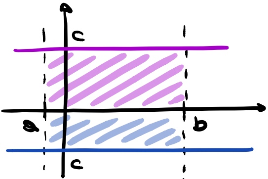
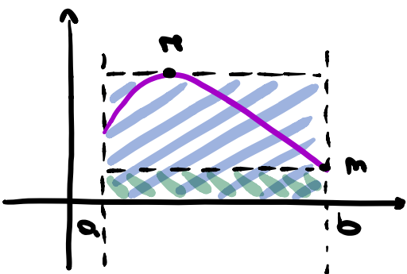

# Integrali

## Integrazione definita

Sia $f:[a,b]\to\mathbb{R}$ continua; si dice trapezoide relativo a $f$ in $[a,b]$, $T_{f}([a,b])$, la regione di piano compresa tra l'asse $x$, le rette verticali $x=a$, $x=b$ e il grafico di $f$.

![Trapezoide relativo ad $f$ in $[a,b]$.](rsc/images/06-Integrali/Integrazione_FIG1.png){height=120}

### L'area del trapezoide

Si consideri il grafico di cui sotto; è possibile cercare di costruire una procedura che definisca l'area del trapezoide mediante due "criteri":

{height=120}

- Misura con segno: considero l'estensione del trapezoide ma anche la sua posizione nel piano.
  - $A^{'}=(b-a)\cdot c$
- Area: legata solamente all'estensione del trapezoide.
  - $A=(b-a)\cdot c$ se $c>0$;
  - $A=-(b-a)\cdot c$ se $c<0$.

Sia $f:[a,b]\to\mathbb{R}$ continua; per il teorema di Weirstrass, $f$ ammette $max(f)\in [a,b]=M$ e $min(f)\in [a,b]=m$ dove $m\leq f(x)\leq M\; \forall x\in [a,b]$.

Considero $f(x)>0$ allora $T_{f}([a,b])$:

![$T_{f}([a,b])$ con $f(x)>0$.](rsc/images/06-Integrali/Integrazione_FIG3.png){height=120}

Individuo il rettangolo correlato al massimo $M$ e il rettangolo correlato al minimo $m$:

{height=120}

Il rettangolo massimo ha estensione $(b-a)M$ con $M>0$ mentre il rettangolo minimo $(b-a)m$ con $m>0$. Vale la relazione $m(b-a)\leq T_{f}([a,b])\leq M(b-a)$.

Considero $f(x)<0$ allora $T_{f}([a,b])$:

![$T_{f}([a,b])$ con $f(x)<0$.](rsc/images/06-Integrali/Integrazione_FIG5.png){height=120}

Individuo il rettangolo correlato al massimo $M$ e il rettangolo correlato al minimo $m$:

{height=120}

Il rettangolo massimo ha estensione $(b-a)M$ con $M<0$ mentre il rettangolo minimo $(b-a)m$ con $m<0$. Vale la relazione $m(b-a)\leq T_{f}([a,b])\leq M(b-a)$.

$\forall n\in\mathbb{N}:n>2$ suddivido l'intervallo $[a,b]$ in $n$ intervalli uguali di ampiezza $\frac{b-a}{n}$: $a=x_{0}<x_{1}<x_{2}<...<x_{n}=b$.

Considero $f$ ristretta all'intervallo $[x_{i}, x_{i+1}]$: $f$ è continua nell'intervallo perciò per il teorema di Weirstrass ha massimo assoluto $M_{i}$ e minimo assoluto $m_{i}$ con $M_{i},m_{i}\in[x_{i},x_{i+1}]$.

![Suddivisione di $[a,b]$.](rsc/images/06-Integrali/Integrazione_FIG7.png){height=120}

Ogni rettangolo associato al massimo ha estensione $\frac{M_{i}(b-a)}{n}$ mentre quello associato al minimo ha estensione $\frac{m_{i}(b-a)}{n}$.

Definizione: Si dice somma superiore n-esima di $f$ relativa ad $[a,b]$:

$$S_{n}=\sum_{i=0}^{n-1}M_{i}(x_{i+1}-x_{i})=\frac{b-a}{n}\sum_{i=0}^{n-1}M_{i}$$

Definizione: Si dice somma inferiore n-esima di $f$ relativa ad $[a,b]$:

$$s_{n}=\sum_{i=0}^{n-1}m_{i}(x_{i+1}-x_{i})=\frac{b-a}{n}\sum_{i=0}^{n-1}m_{i}$$

Osservazione: Per ogni $n\ge 2$ $s_{n}\leq S_{n}$ e tali due sommatorie forniscono approssimazioni (rispettivamente per eccesso e per difetto) della misura con segno di $T_{f}([a,b])$.

![Approssimazione di $T_{f}[a,b]$.](rsc/images/06-Integrali/Integrazione_FIG8.png){height=120}

Se $n$ cresce, l'ampiezza di $\frac{b-a}{n}$ decresce e l'approssimazione diventa più precisa.

La successione $s_{n}$ è crescente mentre $S_{n}$ è decrescente; entrambe sono limitate sia superiormente che inferiormente.

{height=120}

Per il teorema di convergenza delle successioni monotone esistono $\lim_{n\to +\infty}s_{n}$ e $\lim_{n\to +\infty}S_{n}$.

Si può dimostrare che $Inf_{n\in \mathbb{N}}\,s_{n}=Sup_{n\in \mathbb{N}}\,S_{n}$.

Definizione: Si dice integrale definito di $f$ in $[a,b]$ (o misura con segno)

$$\int^{b}_{a}f(x)dx=Inf_{n\in \mathbb{N}}\,s_{n}=Sup_{n\in \mathbb{N}}\,S_{n}$$

Definizione: Definiamo area del trapezoide $T_{f}([a,b])$ la misura con segno della funzione $|f|$ su $[a,b]$

$$A(T_{f}([a,b])=\int_{a}^{b}|f(x)|dx$$

![Area di $T_{f}[a,b]$.](rsc/images/06-Integrali/Integrazione_FIG10.png){height=120}

Osservazione:

- Se $f(x)\ge 0\;\forall x\in [a,b]$ allora $|f(x)|=f(x)$ quindi $A(T_{f}([a,b])=\int_{a}^{b}f(x)dx$.
- Se $f(x)< 0\;\forall x\in [a,b]$ allora $|f(x)|=-f(x)$ quindi $A(T_{f}([a,b])=-\int_{a}^{b}f(x)dx$.
- Se $f(x)\ge 0\;\forall x\in [a,c]$ e $f(x)< 0\;\forall x\in [c,b]$ allora $A(T_{f}([a,b])=\int_{a}^{c}f(x)dx-\int_{c}^{b}f(x)dx$ per le considerazioni fatte sopra.

Sia $f:[a,b]\to\mathbb{R}$ continua, divido $[a,b]$ in $n$ intervalli con ampiezza $\frac{b-a}{n}$: $a=x_{0}<x_{1}<x_{2}<...<x_{n}=b$.

Siano $m_{k}$ e $M_{k}$ il minino e il massimo di $f$ nell'intervallo $[x_{k},x_{k+1}]$.

Su ogni intervallo $[x_{k},x_{k+1}]$ scelgo un punto $y_{k}$ tale che $m_{k}\leq f(y_{k})\leq M_{k}\; \forall 0<k<n-1$.

Costruisco la somma di Cauchy-Riemann:

$$\sigma_{n}=\sum_{k=0}^{n-1}f(y_{k})(x_{k+1}-x_{i})=\frac{b-a}{n}\sum_{k=0}^{n-1}f(x_{k})$$

Si ha quindi che: $s_{n}<\sigma_{n}<S_{n}$ ma siccome $s_{n}$ e $S_{n}$ convergono allo stesso valore anche $\sigma_{n}$ converge a tal valore indipendentemente dalla scelta di $y_{k}$

$$\int_{a}^{b}f(x)dx=\lim_{n\to +\infty}\sigma_{n}=\lim_{n\to +\infty}\frac{b-a}{n}\left[\sum_{k=0}^{n-1}f(y_{k})\right]$$

### Proprietà dell'integrale definito

- Linearità.

$$\int_{a}^{b}[\alpha f(x)+\beta g(x)]=\alpha\int_{a}^{b}f(x)dx+\beta\int_{a}^{b}f(x)dx$$

La linearità dell'integrale è derivata dalla sua correlazione con la somma di Cauchy-Riemann definita a sua volta sull'operatore lineare limite.

- Additività rispetto all'intervallo.

$$\int_{a}^{b}f(x)dx=\int_{a}^{c}f(x)dx+\int_{c}^{b}f(x)dx\; c\in[a,b]$$

- Nullità.

$$\int_{a}^{a}f(x)dx=0\; \forall a\in\mathbb{D_{f}}$$

- Monotonia.

Sia $f(x)\ge 0$ in $[a,b]$ allora $\int_{a}^{b}f(x)dx\ge 0$.

Sia $f(x)\ge g(x)$ in $[a,b]$ allora $\int_{a}^{b}f(x)dx\ge \int_{a}^{b}g(x)dx$.

- Moduli.

$$\left|\int_{a}^{b}f(x)dx\right|\leq \int_{a}^{b}\left|f(x)\right|dx$$

Corollario dalla proprietà di monotonia.

- Altre osservazioni.

Osservazione:

$$\int_{a}^{b}f(x)dx=-\int_{b}^{a}f(x)dx$$

Osservazione: Siano $f(x), g(x)$ funzioni continue con $f(x)\ge g(x)$ su $[a,b]$. Per monotonia: $\int_{a}^{b}=f(x)dx\ge\int_{a}^{b}g(x)dx$. Necessito di calcolare l'area della regione compresa fra i due grafici e le rette $x=a$ e $x=b$.

- Se $f(x)\ge g(x)\ge 0$ per $x\in[a,b]$: $Area[f,g](a,b)=Area[f](a,b)-Area[g](a,b)$.
- Se $f(x)\ge 0\ge g(x)$: $Area[f,g](a,b)=Area[f](a,b)+Area[g](a,b)$.
- Se $0\ge f(x)\ge g(x)$: $Area[f,g](a,b)=Area[g](a,b)-Area[f](a,b)$.
- Se $f(x)\ge g(x)$ non positivi: $Area[f,g](a,b)=\int_{a}^{b}|f(x)-g(x)|dx$.

### ! Teorema della media integrale

Sia $f:[a,b]\to\mathbb{R}$ continua. Allora esiste $c\in [a,b]$ tale che:

$$\frac{1}{b-a}\int_{a}^{b}f(x)dx=f(c)$$

Tale valore prende il nome di "media integrale di $f$ in $[a,b]$".

Dimostrazione: Se $f$ è continua in $[a,b]$ allora, per il teorema di Weirstrass, $f$ ammette massimo e minimo assoluti su $[a,b]$.

Siano assunti $max(f)=M$ e $min(f)=m$ $\forall x\in [a,b]$ allora $m\leq f(x)\leq M$ dunque per la proprietà di monotonia $\int_{a}^{b}mdx\leq \int_{a}^{b}f(x)dx\leq \int_{a}^{b}Mdx$ ossia $m\leq \frac{1}{b-a}\int_{a}^{b}f(x)dx\leq M$.

Per il teorema dei valori intermedi per le funzioni continue esiste in definitiva $c\in [a,b]:\frac{1}{b-a}\int_{a}^{b}f(x)dx=f(c)$.

Osservazione: Esiste $c\in [a,b]$ tale che $\int_{a}^{b}f(x)dx=f(c)(b-a)$.

{height=120}

## Integrali indefiniti

Sia $f:I\to\mathbb{R}$; si dice "primitiva" di $f$ su $I$ una funzione $F:I\to\mathbb{R}$ tale che:

- $F(x)$ è derivabile su $\mathbb{R}$;
- $F^{'}(x)=f(x)$ $\forall x\in\mathbb{R}$.

Data $f:I\to\mathbb{R}$; si dice "integrale indefinito" di $f$ la famiglia delle primitive di $f$ su $I$

$$\int f(x)dx=\{F:I\to\mathbb{R}|f(x)=F^{'}(x)\}=F(x)+c$$

Condizione valida $\forall x\in I$ e $\forall c\in\mathbb{R}$.

Tutte le funzioni elementari, essendo continue, sono anche integrabili.

L'integrale indefinito, come quello definito, è un operatore lineare in virtù della sua definizione sull'operatore lineare derivata.

### Proprietà dell'integrale indefinito

#### ! Teorema: Ogni funzione $f$ continua in un intervallo $I$, ammette primitiva, $F$, in $I$

Osservazione: La primitiva individuata non è una funzione unica! Ogni funzione della forma $F(x)+c$ $\forall c\in\mathbb{R}$ è una possibile primitiva di $f(x)$.

Dimostrazione:

- Dimostro che ogni funzione nella forma $F(x)+c$ è a sua volta una primitiva.

$F(x)+c$ è una funzione derivabile in $I$ (somma di funzioni derivabili) allora:

$$\frac{d}{dx}(F(x)+c)=\frac{d}{dx}F(x)+\frac{d}{dx}c=f+0=f$$

- Siano $F(x),G(x)$ due primitive di $f(x)$; dimostro che la loro differenza è una costante.

Definisco $H(x)=F(x)-G(x)$ funzione derivabile (somma di funzioni derivabili) allora:

$$\frac{d}{dx}H(x)=\frac{d}{dx}F(x)-\frac{d}{dx}G(x)=f(x)-f(x)=0$$

$H(x)$ è una costante: $H(x)=F(x)-G(x)=k$.

### Strategie di calcolo

Per le funzioni più semplici è possibile utilizzare a ritroso la tabella delle derivate ("tabella degli integrali"). Per altri casi è necessario utilizzare metodi di calcolo più sofisticati.

#### Tabella degli integrali

|$\int f(x)dx$|$F(x)$|
|---|---|
|$x^{n}$|$\frac{x^{n+1}}{n+1}+c$|
|$\frac{1}{x}$|$\ln{|x|}+c$|
|$\frac{1}{x^{2}+a^{2}}$|$\frac{1}{a}\arctan{\frac{x}{a}}+c$|
|$\frac{1}{x^{2}-a^{2}}$|$\frac{1}{2a}\ln{|\frac{x-a}{x+a}|}+c$|
|$\frac{1}{\sqrt{x^{2}+a}}$|$\ln{|x+\sqrt{x^{2}+a}|}+c$|
|$a^{x}$|$\frac{a^{x}}{\ln{a}}+c$|
|$e^{x}$|$e^{x}$|
|$\sin{x}$|$-\cos{x}+c$|
|$\cos{x}$|$\sin{x}+c$|
|$\frac{1}{\cos{x}^{2}}$|$\tan{x}+c$|
|$\frac{1}{\sin{x}^{2}}$|$-\cot{x}+c$|

#### Integrazione per parti

Siano $f(x), g(x)$ due funzioni derivabili in $I$, allora vale la seguente formula:

$$\int f(x)g^{'}(x)dx=f(x)g(x)-\int f^{'}g(x)dx$$

#### Integrazione per sostituzione

Sia $f:I\to\mathbb{R}$ e sia $\phi:J\to I$ derivabile tale che $\phi(t)=x$ allora vale la seguente formula:

$$\int f(\phi(t))\phi^{'}(t)dt=\int f(x)dx$$

## Teoremi fondamentali del calcolo integrale

Sia $f:[a,b]\to\mathbb{R}$ continua $\forall x\in[a,b]$ allora tale funzione è continua anche nell'intervallo $[a,x]$.

Definisco una funzione $F:[a,b]\to\mathbb{R}$ come $f(x)\to\int_{a}^{x}f(t)dt$.

{height=120}

### ! Primo teorema fondamentale del calcolo integrale

Sia $f:[a,b]\to\mathbb{R}$ continua, definita $F:[a,b]\to\mathbb{R}$ tale che $F(x)=\int_{a}^{x}f(t)dt$ allora: $\forall x\in (a,b)$ $F$ è derivabile ed è tale che $F^{'}(x)=f(x)$ $\forall x\in[a,b]$.

Se $x=a$ $F$ è derivabile da sinistra; se $x=b$ $F$ è derivabile da destra.

Dimostrazione: Per ogni $x\in(a,b)$

$$\lim_{h\to 0}\frac{F(x+h)-F(x)}{h}=\lim_{h\to 0}\frac{\int_{a}^{x+h}f(t)dt-\int_{a}^{x}f(t)dt}{h}=$$

$$=\lim_{h\to 0}\frac{\int_{a}^{x}f(t)dt+\int_{x}^{x+h}f(t)dt-\int_{a}^{x}f(t)dt}{h}=\lim_{h\to 0}\frac{\int_{x}^{x+h}f(t)dt}{h}$$

La funzione $f:[x,x+h]\to\mathbb{R}$ è continua, per il teorema della media integrale esiste $c\in[x,x+h]$ tale che: $\int_{x}^{x+h}f(t)dt=f(c)\cdot h$ e $x<c<x+h$.

Per il teorema del confronto $\lim_{h\to 0}c=x$ ne consegue che $f$ è continua in $c$: $\lim_{h\to 0}f(c)=f(x)$.

$$\lim_{h\to 0}\frac{\int_{x}^{x+h}f(t)dt}{h}=\lim_{h\to 0}\frac{f(c)\cdot h}{h}=\lim_{h\to 0}f(c)=f(x)$$

Ne consegue che $F$ è derivabile in $x$ e $F^{'}(x)=f(x)$ per $x\in (a,b)$.

La dimostrazione è la medesima anche per i casi limite $x=a$ e $x=b$.

Osservazione: $F$ è una primitiva di $f$ su $[a,b]$.

### ! Secondo teorema fondamentale del calcolo integrale

Sia $f:[a,b]\to\mathbb{R}$ continua. Sia $P$ una primitiva di $f$ su $[a,b]$. Allora:

$$\int_{a}^{b}P^{'}(x)=P(b)-P(a)$$

Osservazione: Il teorema è resistente anche alle discontinuità.

Dimostrazione: Definisco $F(x)=\int_{a}^{x}f(t)dt$ funzione integrale tale che $F(a)=0$.

$F$ è derivabile in $[a,b]$ quindi $F$ è continua in $[a,b]$; costruisco $G(x)=P(x)-F(x)$. $G(x)$ è continua e derivabile in $[a,b]$ (differenza di funzioni continue e derivabili).

$$G^{'}(x)=\underbrace{P^{'}(x)}_{f(x)\,\text{per ipotesi}}-\underbrace{F^{'}(x)}_{f(x)\,\text{per conseguenza del I Teorema}}=0\; \forall x\in[a,b]$$

Ne consegue che $G(x)$ è costante: $G(x)=G(a)=G(b)\; \forall x\in[a,b]$.

$$F(a)=0\; f(b)=\int_{a}^{b}f(t)dt$$

Per definizione precedente: $P(x)=G(x)+F(x)$.

$$P(a)=G(a)+F(a)=G(a)$$

$$P(b)=G(b)+F(b)=G(a)+F(b)$$

$$P(b)-P(a)=G(a)+F(b)-G(a)=$$

$$=F(b)=\int_{a}^{b}f(t)dt=\int_{a}^{b}P^{'}(t)dt$$

## Integrali impropri o generalizzati

Sia $f:[a,b)\to\mathbb{R}$ funzione continua con $\lim_{x\to b^{-}}f(x)=\pm\infty$ (la funzione non è quindi limitata nell'intorno di $b$); $f$ si dice integrabile in senso generalizzato se esiste finito il limite:

$$\lim_{\epsilon\to 0^{+}}\int_{a}^{b-\epsilon}f(t)dt$$

In tal caso si dice che l'integrale $\int_{a}^{b}f(x)dx$ converge. Se il limite dovesse tendere a un infinito invece, l'integrale si dice divergente.

Osservazione: Il punto $\epsilon$ è scelto in modo da trovare una restrizione continua e limitata di $f$: $[a,b-\epsilon]$ dove risulta valido il teorema fondamentale del calcolo integrale.

![Restrizione di $f$ in $[a,b-\epsilon]$.](rsc/images/06-Integrali/Integrali_Impropri_FIG1.png){height=120}

In maniera simile, sia $f:[a,+\infty)\to\mathbb{R}$ continua; $f$ si dice integrabile in senso generalizzato su $[a,+\infty)$ se esiste finito il limite:

$$\lim_{M\to +\infty}\int_{a}^{M}f(t)dt$$

In tal caso si dice che l'integrale $\int_{a}^{+\infty}f(x)dx$ converge; altrimenti, l'integrale si dice divergente.

Osservazione: Analogamente a prima, la definizione si basa sulla creazione di una restrizione di $f$: $[a,M]$ dove vale il teorema fondamentale del calcolo integrale.

![Restrizione di $f$ in $[a,M]$.](rsc/images/06-Integrali/Integrali_Impropri_FIG2.png){height=120}

### Criteri d'integrabilità (per funzioni positive)

#### ! Criterio del confronto

- Siano $f,g:[a,b)\to\mathbb{R}$ continue e tali che $\lim_{x\to b}f(x)=\lim_{x\to b}g(x)=\infty$. Siano $f,g$ non negative e tali che $f(x)\leq g(x)$ $\forall x\in[a,b)$. Allora se $\int_{a}^{b}g(x)$ converge convergerà pure $\int_{a}^{b}f(x)$; se $\int_{a}^{b}g(x)$ diverge allora diverge anche $\int_{a}^{b}f(x)$.

Dimostrazione: Per ipotesi è noto che $0\leq f(x)\leq g(x)$ $\forall x\in [a,b)$; per la monotonia dell'integrale:

$$0\leq\int_{a}^{b-\epsilon}f(x)dx\leq\int_{a}^{b-\epsilon}g(x)dx$$

Considerando invece il limite per $\epsilon\to 0^{+}$:

$$0\leq\lim_{\epsilon\to 0^{+}}\underbrace{\int_{a}^{b-\epsilon}f(x)dx}_{F(b-\epsilon)-F(a)}\leq\lim_{\epsilon\to 0^{+}}\underbrace{\int_{a}^{b-\epsilon}g(x)dx}_{G(b-\epsilon)-G(a)}$$

Si osserva che $F(a)\leq G(a)$ e $F(b-\epsilon)\leq G(b-\epsilon)$; le funzioni $F(b-\epsilon)$ e $G(b-\epsilon)$ sono non decrescenti. Dunque, per il teorema del confronto fra limiti:

$$0\leq\int_{a}^{b}f(x)dx\leq\int_{a}^{b}g(x)dx$$

- Siano $f,g:[a,+\infty)\to\mathbb{R}$ continue, non negative e tali che $f(x)\leq g(x)$ $\forall x\in[a,+\infty)$ allora: se $\int_{a}^{+\infty}g(x)$ converge convergerà pure $\int_{a}^{+\infty}f(x)$; analogamente se $\int_{a}^{+\infty}g(x)$ diverge anche $\int_{a}^{+\infty}f(x)$ diverge.

Dimostrazione: Per ipotesi è noto che $0\leq f(x)\leq g(x)$ $\forall x\in [a,+\infty)$; per la monotonia dell'integrale:

$$0\leq\int_{a}^{M}f(x)dx\leq\int_{a}^{M}g(x)dx$$

Considerando invece il limite per $M\to +\infty$:

$$0\leq\lim_{M\to +\infty}\underbrace{\int_{a}^{M}f(x)dx}_{F(M)-F(a)}\leq\lim_{M\to +\infty}\underbrace{\int_{a}^{M}g(x)dx}_{G(M)-G(a)}$$

Le funzioni integrali $F(M)$ e $G(M)$ sono non decrescenti, per il teorema del confronto fra limiti:

$$0\leq\int_{a}^{+\infty}f(x)dx\leq\int_{a}^{+\infty}g(x)dx$$

#### ! Criterio del confronto asintotico

- Siano $f,g:[a,b)\to\mathbb{R}$ continue e tali che $\lim_{x\to b}f(x)=\lim_{x\to b}g(x)=\infty$. Siano $f,g$ non negative e tali che $\lim_{x\to b}\frac{f(x)}{g(x)}=1$. $\int_{a}^{b}f(x)$ converge se e solo se converge $\int_{a}^{b}g(x)$.

Dimostrazione: Per ipotesi è noto che: $0\leq f(x)\leq g(x)$ $\forall x\in [a,b)$ e che $f(x)\sim g(x)$ per $x\to b^{-}$. Per definizione di limite:

$$\lim_{x\to b^{-}}\frac{f(x)}{g(x)}=1\implies\forall\epsilon>0\exists\delta>0:\forall x\in (b-\delta,b)\;\left|\frac{f(x)}{g(x)}-1\right|<\epsilon$$

Poiché $-\epsilon<\frac{f(x)}{g(x)}<\epsilon$ si ha che $f(x)<(1+\epsilon)g(x)$ e $(1+\epsilon)g(x)<f(x)$ $\forall x\in(b-\delta,b)$.

Considero $g(x)(1-\epsilon)<f(x)$ $\forall x\in(b-\delta,b)$; applicando il criterio del confronto si ha che:

$$\int_{b-\delta}^{b}(1-\epsilon)g(x)dx\leq\int_{b-\delta}^{b}f(x)dx$$

Se $\int_{b-\delta}^{b}f(x)dx$ converge allora converge anche $\int_{b-\delta}^{b}(1-\epsilon)g(x)dx$.

In maniera analoga è possibile dimostrare anche che se $\int_{a}^{b}g(x)dx$ converge allora converge anche $\int_{a}^{b}f(x)dx$.

- Siano $f,g:[a,+\infty)\to\mathbb{R}$ continue, non negative e tali che $\lim_{x\to b}\frac{f(x)}{g(x)}=1$. $\int_{a}^{b}f(x)$ converge se e solo se converge $\int_{a}^{b}g(x)$.

Dimostrazione: Per ipotesi è noto che: $0\leq f(x)\leq g(x)$ $\forall x\in [a,+\infty)$ e che $f(x)\sim g(x)$ per $x\to +\infty$. Per definizione di limite:

$$\lim_{x\to +\infty}\frac{f(x)}{g(x)}=1\implies\forall\epsilon>0\exists M>0:\forall x>M\;\left|\frac{f(x)}{g(x)}-1\right|<\epsilon$$

Poiché $-\epsilon<\frac{f(x)}{g(x)}<\epsilon$ si ha che $f(x)<(1+\epsilon)g(x)$ e $(1+\epsilon)g(x)<f(x)$ $\forall x>M$.

Considero $g(x)(1-\epsilon)<f(x)$ $\forall x>M$; applicando il criterio del confronto si ha che:

$$\int_{M}^{+\infty}(1-\epsilon)g(x)dx\leq\int_{M}^{+\infty}f(x)dx$$

Se $\int_{M}^{+\infty}f(x)dx$ converge allora converge anche $\int_{M}^{+\infty}(1-\epsilon)g(x)dx$.

In maniera analoga è possibile dimostrare anche che se $\int_{a}^{+\infty}g(x)dx$ converge allora converge anche $\int_{a}^{+\infty}f(x)dx$.

## Criteri d'integrabilità (per funzioni negative)

Se $f(x)$ fosse negativa (o comunque non positiva), usando le proprietà degli integrali, posso scegliere una funzione $h(x)$ tale che:

$$\underbrace{-f(x)}_{h(x)\ge 0}\ge 0$$

Su $h(x)$ è possibile utilizzare i criteri per le funzioni positive e $h$ condivide lo stesso "comportamento" di $f$.

## Criteri d'integrabilità (per funzioni a segno variabile)

### Criterio di convergenza assoluta

- Sia $f:[a,b)\to\mathbb{R}$ continua e tale che $\lim_{b^{-}}f(x)=\infty$. Considero la funzione $|f|$, se $\int_{a}^{b}|f(x)|dx$ allora anche $\int_{a}^{b}f(x)dx$ converge; inoltre, si ha che $|\int_{a}^{b}f(x)dx|\leq\int_{a}^{b}|f(x)|dx$ (per diseguaglianza triangolare). Attenzione: il teorema non è invertibile!
- Sia $f:[a,+\infty)\to\mathbb{R}$ continua. Considero la funzione $|f|$, se $\int_{a}^{b}|f(x)|dx$ allora anche $\int_{a}^{b}f(x)dx$ converge; inoltre, si ha che $|\int_{a}^{b}f(x)dx|\leq\int_{a}^{b}|f(x)|dx$ (per diseguaglianza triangolare). Attenzione: il teorema non è invertibile!

## Tabella degli integrali generalizzati

- Sia $\alpha >0$

$$\int_{0}^{\alpha}\frac{1}{x^{p}}dx\rightarrow\begin{cases}\text{converge}&\text{se }p<1\\\text{diverge}&\text{se }p \geq 1\end{cases}$$

$$\int_{a}^{b}\frac{1}{(x-a)^{p}}dx\rightarrow\begin{cases}\text{converge}&\text{se }p<1\\ \text{diverge}&\text{se }p \geq 1\end{cases}$$

$$\int_{\alpha}^{+\infty}\frac{1}{x^{p}}dx\rightarrow\begin{cases}\text{converge}&\text{se }p>1\\ \text{diverge}&\text{se }p\leq 1\end{cases}$$

- Sia $0<\alpha<1$

$$\int_{0}^{\alpha}\frac{1}{x^{a}|\ln(x)|^{b}}\rightarrow\begin{cases}\text{converge}&\text{se}\begin{cases}a<1&\forall b\in\mathbb{R}\\a=1&b>1\end{cases}\\ \text{diverge}&\text{se}\begin{cases}a>1& \forall b\in\mathbb{R}\\ a=1&b\leq 1\end{cases}\end{cases}$$

- Sia $\alpha>1$

$$\int_{\alpha}^{+\infty}\frac{1}{x^{a}\ln^{b}(x)}d x\rightarrow\begin{cases}\text{converge}&\text{se}\left\{\begin{array}{l}a>1\text{ e }b\in\mathbb{R}\\ \text {oppure}\\a=1\text{ e }b>1\end{array}\right.\\ \text {diverge}&\text{se}\left\{\begin{array}{l}a<1\text{ e }b\in\mathbb{R}\\ \text {oppure}\\ a=1\text{ e }b\leq 1\end{array}\right.\end{cases}$$

$$\int_{1}^{\alpha}\frac{1}{\ln^{p}(x)}dx\rightarrow\begin{cases}\text{converge}&\text{se }p<1\\ \text{diverge }&\text{se }p \geq 1\end{cases}$$
